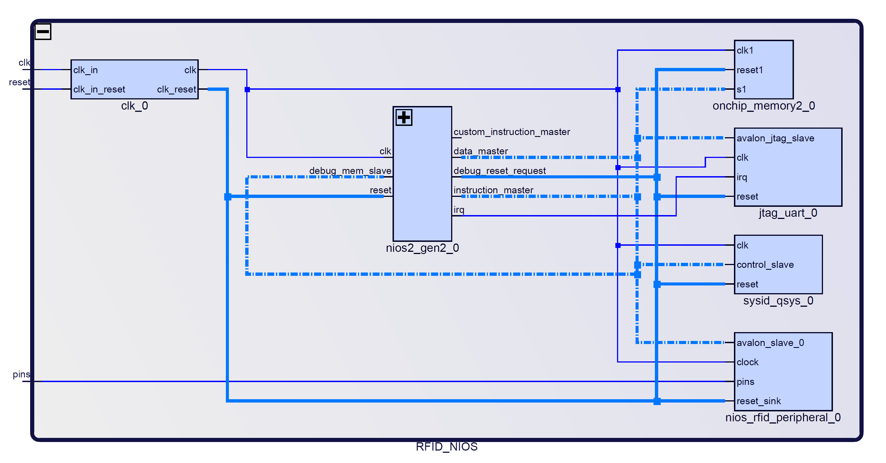

# IP core interface

Below is an in depth explanation of the mechanism responsible for the communication between the Nios II processor and the IP core, which is composed by the Avalon Interface and a register bank that connect the other components.

## Solution Diagram

In this diagram, generated by the Platform Designer, it is possible to see the overview of the solution implemented by the group. Inside, the clock interface, Nios II processor, memory, and IP core are connected by the Avalon Interface, represented by the blue dotted lines.

*Diagram generated by the Quartus Platform Designer*

The Cyclone V FPGA clock interface works on a 50MHz clock speed, which allows for multiple clocks between each tari interval, ensuring that the encoding and decoding processes run smoothly. All the time intervals necessary for communication, as present in the EPC-GEN2 documentation, are also calculated based on the original 50MHz clock.

The Nios II soft processor used in this project was implemented by the team and is based on RISC architecture. It is responsible for generating all the commands sent to the tag, as well as interpreting the responses our device receives. More information on the Nios II can be found [here](firmware.md).

The on-chip memory is the RAM memory for the system. It is accessed through the Avalon bus which writes and reads data on the register bank. It has 115.199 addressable bytes divided between the different interfaces.

The IP core contains all the VHDL components of our projects, encompassing both the sender and receiver, as well as all their inner components. These are also accessed by the Avalon bus to receive settings and commands, as well as to send the responses back to the processor. More information on the IP core can be found [here](hardware.md).

## Avalon Interface

The Avalon Interface, according to its developer Intel®: "Avalon® interfaces simplify system design by allowing you to easily connect components in Intel® FPGA. The Avalon interface family defines interfaces appropriate for streaming high-speed data, reading, and writing registers and memory, and controlling off-chip devices. Components available in Platform Designer incorporate these standard interfaces. Additionally, you can incorporate Avalon interfaces in custom components, enhancing the interoperability of designs.".

In other words, it is possible to conclude from this excerpt that, in addition to enabling the connection between Intel® FPGA components, that once the interfaces are added to Platform Designer, they can connect custom components, which the group uses for the IP core in our product. All documentation for other possible interfaces and connection is present in the document “Avalon® Interface Specifications”.

The Avalon Bus can be implemented with multiple features and modules. In this project, Avalon Memory-Mapped will be used, but other alternatives were considered, such as Avalon Interrupt Interfaces and Avalon Streaming Interfaces.

The Avalon Memory-Mapped (Avalon-MM) interface implements both the Instruction and the Data Master Ports. Both of them share a single memory and also a single bus to outside of the processor. According to the same document the data and instructions master ports never cause a gridlock in which one port starves the other.

The one accessed directly by the software on this project is the Data Master Port, which is a 32-bit bus capable of reading and writing in the memory or in any other peripheral of the project, just like it does in our IP core. This bus is one of the dotted line in the platform designer image above.

## Register Bank

The register bank intermediates the communication between the Nios II processor and the IP core. Each access to the bus is done through a `read` or `write` command in which they carry data up to 32 bits, a value that represents the size of an integer in the programming language C, as it is the one implemented in the processor.

As seen in the table, this communication path is responsible for the IP peripheral settings, informing essential values for communication such as `Tari`, `Delimiter` and `Status`, as well as others shown below.

| offset | Name                  | Access     | Size (bits) |
|--------|-----------------------|------------|-------------|
|      0 | REG_Settings          | Read/Write |          32 |
|      1 | REG_Tari              | Read/Write |          16 |
|      2 | REG_FIFO              | Write      |          32 |
|      3 | REG_Tari_101          | Write      |          16 |
|      4 | REG_Tari_099          | Write      |          16 |
|      5 | REG_Tari_1616         | Write      |          16 |
|      6 | REG_Tari_1584         | Write      |          16 |
|      7 | REG_Pw                | Write      |          16 |
|      8 | REG_Delimiter         | Write      |          16 |
|      9 | REG_RTcal             | Write      |          16 |
|     10 | REG_TRcal             | Write      |          16 |
|      3 | REG_Status            | Read       |          32 |
|      4 | REG_Receiver_data_out | Read       |          32 |
|      5 | REG_Sender_usedw      | Read       |           8 |
|      6 | REG_Receiver_usedw    | Read       |           8 |
|      7 | REG_IP-ID             | Read       |          32 |

While some registers indicate a single variable, such as those that indicate Tari values, others carry multiple peripheral control variables with them, those being `REG_SETTINGS` and `REG_STATUS`.

### Offset 0 - REG_Settings (R/W)

The Register Settings is responsible for the control of the IP core, as a Read and Write register it is capable of setting flags, making pulses in specific bits and also activating components of the IP core

|         31         |            30           |       29       |           28          |       27       |            26            |       25       |      24      |
|:------------------:|:-----------------------:|:--------------:|:---------------------:|:--------------:|:------------------------:|:--------------:|:------------:|
|          x         |            x            |        x       |           x           |        x       |             x            |        x       |       x      |
|       **23**       |          **22**         |     **21**     |         **20**        |     **19**     |          **18**          |     **17**     |    **16**    |
|          x         |            x            |        x       |           x           |        x       |             x            |        x       |       x      |
|       **15**       |          **14**         |     **13**     |         **12**        |     **11**     |          **10**          |      **9**     |     **8**    |
|          x         |            x            |        x       | Receiver read request | Receiver reset | Sender clr finished send |        x       |   Loopback   |
|        **7**       |          **6**          |      **5**     |         **4**         |      **3**     |           **2**          |      **1**     |     **0**    |
| Sender is preamble | Sender start controller | Sender has_gen |    Receiver enable    |        x       |     Sender clear FIFO    | Sender  enable | Sender reset |

- Bits 31 through 13 are unused, instead being reserved for future implementations.
- Bit 12 - `Receiver read request` stores the read request flag for the Receiver FIFO;
- Bit 11 - `Receiver reset` stores the reset flag for the Receiver;
- Bit 10 - `Sender clr finished send` stores the Sender clear finished send flag;
- Bit 9 -  unused;  
- Bit 8 - `Loopback` stores the loopback flag used in testing the reader;
- Bit 7 - `Sender is preamble` stores the preamble flag for the Sender generator;
- Bit 6 - `Sender start controller` stores the start controller flag for the Sender;
- Bit 5 - `Sender has_gen` stores the generator flag for the Sender;
- Bit 4 - `Receiver enable` stores the enable flag for the Receiver;
- Bit 3 -  unused;  
- Bit 2 - `Sender clear FIFO` stores the clear FIFO flag for the Sender FIFO;
- Bit 1 - `Sender enable` stores the enable flag for the Sender;
- Bit 0 - `Sender reset` stores the reset flag for the Sender;

### Offset 1 - REG_Tari (R/W)

The Register Tari carries the time parameter to the IP Core, in the software it is declared as an int and can vary between 313 to 1250 values. These range is calculated by multiplying frequency of the µProcessor times the tari range. The tari range is 6.25µs to 25µs, which is also stablished in EPC-GEN2 Documentation.

Some values can be used to manually set the tari time parameter. Values from the range of 300 - 600 are allowed by the EPC-GEN2 documentation.

The tari is written in the Register Tari from least significant (0) to most significant bit (15) of the register. Depending only on the binary value for the Integer mentioned previously.

| **15** | **14** | ... | **2** | **1** | **0** |
|:------:|:------:|:---:|:-----:|:-----:|:-----:|
|    x   |    x   | ... |   x   |   x   |   x   |

### Offset 2 - REG_FIFO (W)

The register FIFO carries the package, from the C Software to the IP core through Avalon bus.

The FIFO register is also written from least significant (0) to most significant bit (31) of the register. In which the six least significant bits are the mask which carries the size of the data and the remaining 26 are reserved for data itself.

| **31** | **30** | **...** | **2** | **1** | **0** |
|:------:|:------:|:-------:|:-----:|:-----:|:-----:|
|    x   |    x   |   ...   |   x   |   x   |   x   |

### TARI limit Registers

The Registers 3 to 6 are called Registers Tari Boundaries, they stablish the 1%-time variation in which the reader can communicate with the tag. If the tag does not reply in time or if the Sender or Receiver peripherals delay, an error flag will be raised as if the communication had ended.

Each Tari Boundary is written its respective Register from least significant (0) to most significant bit (15) of the register. Depending only on the binary value for the Integer that it represents.

#### Offset 3 - REG_Tari_101 (W)

| **15** | **14** | ... | **2** | **1** | **0** |
|:------:|:------:|:---:|:-----:|:-----:|:-----:|
|    x   |    x   | ... |   x   |   x   |   x   |

Stores the tari upper limit.

#### Offset 4 - REG_Tari_099 (W)

| **15** | **14** | ... | **2** | **1** | **0** |
|:------:|:------:|:---:|:-----:|:-----:|:-----:|
|    x   |    x   | ... |   x   |   x   |   x   |

Stores the tari lower limit.

#### Offset 5 - REG_Tari_1616 (W)

| **15** | **14** | ... | **2** | **1** | **0** |
|:------:|:------:|:---:|:-----:|:-----:|:-----:|
|    x   |    x   | ... |   x   |   x   |   x   |

stores the 1.6 tari upper limit.

#### Offset 6 - REG_Tari_1584 (W)

| **15** | **14** | ... | **2** | **1** | **0** |
|:------:|:------:|:---:|:-----:|:-----:|:-----:|
|    x   |    x   | ... |   x   |   x   |   x   |

stores the 1.6 tari lower limit.

### Preamble and Framesync time parameter registers

The following registers are also time parameters which can be seen in the Preamble and Frame-sync images, they are part of the RFID modulation and a future implementation of Radio frequency depends on these values to be set.

Each value written its respective Register from least significant (0) to most significant bit (15) of the register. Depending only on the binary value for the Integer that it represents.

#### Offset 7 - REG_Pw (W)

Stores the value of a half-tari, which is used in the signal generator component to generate the preamble or frame-sync.

| **15** | **14** | ... | **2** | **1** | **0** |
|:------:|:------:|:---:|:-----:|:-----:|:-----:|
|    x   |    x   | ... |   x   |   x   |   x   |

#### Offset 8 - REG_Delimiter (W)

Stores a value between 0.5 - 1.0 tari responsible for starting the communication between reader and tag.

| **15** | **14** | ... | **2** | **1** | **0** |
|:------:|:------:|:---:|:-----:|:-----:|:-----:|
|    x   |    x   | ... |   x   |   x   |   x   |

#### Offset 9 - REG_RTcal (W)

Stores the RTcal variable, which is based on the data lenght of the communication.

| **15** | **14** | ... | **2** | **1** | **0** |
|:------:|:------:|:---:|:-----:|:-----:|:-----:|
|    x   |    x   | ... |   x   |   x   |   x   |

#### Offset 10 - REG_TRcal (W)

Stores the TRcal variable, which is used by the reader to specify the tag's backscatter link frequency.

| **15** | **14** | ... | **2** | **1** | **0** |
|:------:|:------:|:---:|:-----:|:-----:|:-----:|
|    x   |    x   | ... |   x   |   x   |   x   |

### Offset 3 - REG_Status (R)

In contrast to the `REG_Settings`, the `REG_Status` is a read only register from the processor. It carries errors and others status flags explained bellow.

|   31   |       30      |       29       |        28       |            27           |              26              |           25           |          24         |
|:------:|:-------------:|:--------------:|:---------------:|:-----------------------:|:----------------------------:|:----------------------:|:-------------------:|
|    x   |       x       |        x       |        x        |            x            |               x              |            x           |          x          |
| **23** |     **22**    |     **21**     |      **20**     |          **19**         |            **18**            |         **17**         |        **16**       |
|    x   |       x       |        x       |        x        |            x            |               x              |            x           |          x          |
| **15** |     **14**    |     **13**     |      **12**     |          **11**         |            **10**            |          **9**         |        **8**        |
|    x   | Receiver full | Receiver empty | Receiver sclear |            x            | Receiver clear error decoder | Receiver error decoder |          x          |
|  **7** |     **6**     |      **5**     |      **4**      |          **3**          |             **2**            |          **1**         |        **0**        |
|    x   |       x       |        x       |        x        | Sender finished sending |               x              |            x           | Sender is fifo full |

- Bits 31 through 15 are not in use, instead being reserved for future implementations.
- Bit 14 - `Receiver full` stores the full flag for the Receiver FIFO;
- Bit 13 - `Receiver empty` stores the empty flag for the Recevier FIFO;
- Bit 12 - `Receiver sclear`stores the clear flag for the Receiver FIFO;
- Bit 10 - `Receiver clear error decoder` stores the clear error flag for the Receiver decoder;
- Bit 9 - `Receiver error decoder` stores the error flag for the Receiver decoder;
- Bit 3 - `Sender finished sending` stores the finished sending flag for the Sender FIFO;
- Bit 0 - `Sender is fifo full` stores the full flag for the Sender FIFO;

### Offset 4 - REG_Receiver_data_out (R)

The Register `Receiver data out` is the output of the Receiver peripheral from the IP core. This Register carries a package built from the signal received, this package comes from the FIFO in which it was stored. A combination of one or more packages read from this register makes a command.

This register is written from least significant (0) to most significant bit(31) of the register. In which the least six significant bits are the mask that carries the size of the data and the remaining 26 are reserved for data itself.

| **31** | **30** | **...** | **2** | **1** | **0** |
|:------:|:------:|:-------:|:-----:|:-----:|:-----:|
|    x   |    x   |   ...   |   x   |   x   |   x   |

### FIFO Package count Registers

The next two registers store the number of packages in their respective FIFOs. The former being the Sender FIFO and the latter being the Receiver FIFO.

Both registers are automatically filled by the Intel FIFO and are just read by the C software through the Avalon bus.

#### Offset 5 - REG_Sender_usedw (R)

Stores the usedw variable for the Sender FIFO, which specifies the amount of words currently stored in their memory.

| **7** | **6** | ... | **2** | **1** | **0** |
|:-----:|:-----:|:---:|:-----:|:-----:|:-----:|
|   x   |   x   | ... |   x   |   x   |   x   |

#### Offset 6 - REG_Receiver_usedw (R)

Stores the usedw variable for the Receiver FIFO, which specifies the amount of words currently stored in their memory.

| **7** | **6** | ... | **2** | **1** | **0** |
|:-----:|:-----:|:---:|:-----:|:-----:|:-----:|
|   x   |   x   | ... |   x   |   x   |   x   |

### Offset 7 - REG_IP-ID (R)

This register stores the ID of the IP core so that is possible to verify if the software is communicating properly with the IP core and if it is correctly addressing the Avalon bus.
The binary value above can be read in Hex as `0XFF0055FF`, and it is written to the Register IP-ID from least significant (0) to most significant bit (31).

|   31   |   30   |   29   |   28   |   27   |   26   |   25   |   24   |
|:------:|:------:|:------:|:------:|:------:|:------:|:------:|:------:|
|    1   |    1   |    1   |    1   |    1   |    1   |    1   |    1   |
| **23** | **22** | **21** | **20** | **19** | **18** | **17** | **16** |
|    0   |    0   |    0   |    0   |    0   |    0   |    0   |    0   |
| **15** | **14** | **13** | **12** | **11** | **10** |  **9** |  **8** |
|    0   |    1   |    0   |    1   |    0   |    1   |    0   |    1   |
|  **7** |  **6** |  **5** |  **4** |  **3** |  **2** |  **1** |  **0** |
|    1   |    1   |    1   |    1   |    1   |    1   |    1   |    1   |
