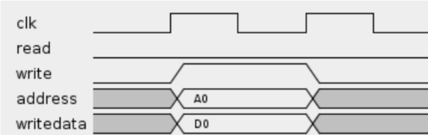

### Firmware

Below is an in depth explanation of the mechanism responsible for the communication between the NIOS II processor and the IP Core, which is composed by the Avalon Interface and a register bank that connect the other components.

#### Avalon Interface

The Avalon Interface, according to its developer Intel (in “Avalon® Interface Specifications”, 2021, p.4): "Avalon® interfaces simplify system design by allowing you to easily connect components in Intel® FPGA. The Avalon interface family defines interfaces appropriate for streaming high-speed data, reading and writing registers and memory, and controlling off-chip devices. Components available in Platform Designer incorporate these standard interfaces. Additionally, you can incorporate Avalon interfaces in custom components, enhancing the interoperability of designs.".

In other words, it is possible to conclude from this excerpt that, in addition to enabling the connection between Intel® FPGA components, that once the interfaces are added to Platform Designer, they are able to connect custom components, which we use for the IP Core in out product. All documentation for other possible interfaces and connection is present in the document “Avalon® Interface Specifications”.

The Avalon Bus can be implemented with multiple features and modules. In this project, Avalon Memory-Mapped will be used, but other alternatives were considered, such as Avalon Interrupt Interfaces and Avalon Streaming Interfaces.

The Avalon Memory-Mapped (Avalon-MM) interface implements the writing and reading of interfaces for the other components used, including Memory, UART Chip and the NIOS II. The interface uses a Host and Agent system in which the Host is the provider of data and commands to the Agent, while the Agent responds to the Host.

These relations can be viewed in the images below, which represent an example of Host and Agent communication in the first image, and an example of writing to a address in the second one.

{width=70%}

{width=70%}

#### Register Bank

The register bank intermediates the communication between the NIOS II processor and the IP Core. Each access to the bus is done through a `read` or `write` command in which they carry data up to 32 bits, a value that represents the size of an integer in the programming language C, as it is the one implemented in the processor. 

As seen in the table, this communication path is responsible for the IP peripheral settings, informing essential values for communication such as `Tari`, `Delimiter` and `Status`, as well as others shown below.

| offset | Name              | Access     | Size |
|--------|-------------------|------------|------|
|      0 | Settings          | Read/Write |   32 |
|      4 | Tari              | Read/Write |   16 |
|      8 | Fifo              | Write      |   32 |
|     12 | Tari_101          | Write      |   16 |
|     16 | Tari_099          | Write      |   16 |
|     20 | Tari_1616         | Write      |   16 |
|     24 | Tari_16584        | Write      |   16 |
|     28 | Pw                | Write      |   16 |
|     32 | Delimiter         | Write      |   16 |
|     36 | RTcal             | Write      |   16 |
|     40 | TRcal             | Write      |   16 |
|      8 | Status            | Read       |   32 |
|     12 | Receiver_data_out | Read       |   32 |
|     16 | Sender_usedw      | Read       |    8 |
|     20 | Receiver_usedw    | Read       |    8 |
|     24 | IP-ID             | Read       |    8 |

**Register 0 - Settings (read/write)**

While some registers indicate a single variable, such as those that indicate `Tari` values, others carry multiple peripheral control variables with them, those being the `settings` and `status register`. Every register is defined bit by bit in the table below:

|         15         |            14           |       13       |           12          |       11       |            10            |        9       |       8      |
|:------------------:|:-----------------------:|:--------------:|:---------------------:|:--------------:|:------------------------:|:--------------:|:------------:|
|          x         |            x            |        x       | Receiver read request | Receiver reset | Sender clr finished send |        x       |   Loopback   |

|          7         |            6            |        5       |           4           |        3       |             2            |        1       |       0      |
|:------------------:|:-----------------------:|:--------------:|:---------------------:|:--------------:|:------------------------:|:--------------:|:------------:|
| Sender is preamble | Sender start controller | Sender has_gen |    Receiver enable    |        x       |     Sender Clear fifo    | Sender  Enable | Sender Reset |

**Register 8 - Status (read)**

In both registers represented here, the bits 31 through 16 are not in use, instead being reserved for future implementations.

| 15 |       14      |       13       |        12       |            11           |              10             |            9           |          8          |
|:--:|:-------------:|:--------------:|:---------------:|:-----------------------:|:---------------------------:|:----------------------:|:-------------------:|
|  x | Receiver full | Receiver empty | Receiver sclear |            x            | Receiver clear error decoder| Receiver error decoder |          x          |

|  7 |       6       |        5       |        4        |            3            |              2              |            1           |          0          |
|:--:|:-------------:|:--------------:|:---------------:|:-----------------------:|:---------------------------:|:----------------------:|:-------------------:|
|  x |       x       |        x       |        x        | Sender finished sending |              x              |            x           | Sender is fifo full |
