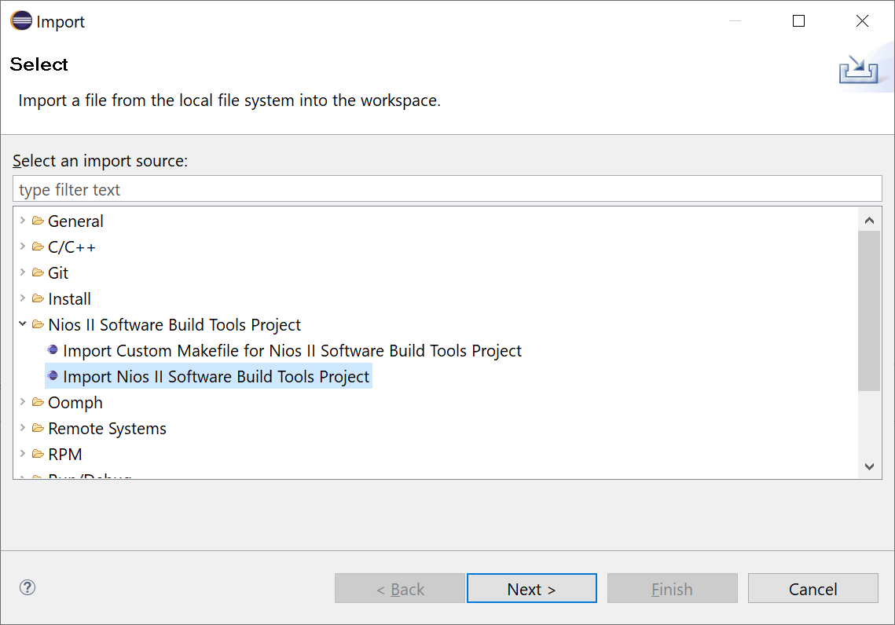
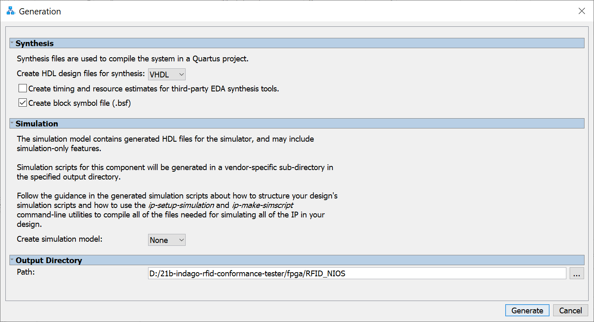
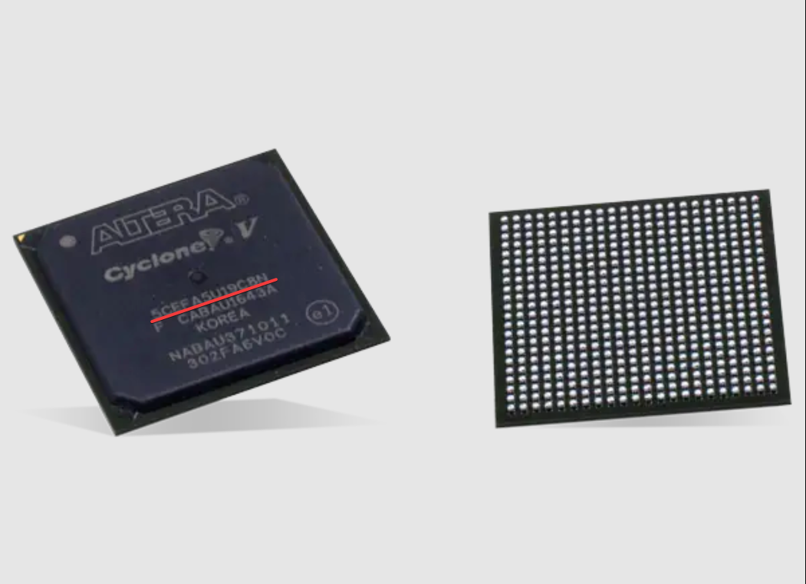
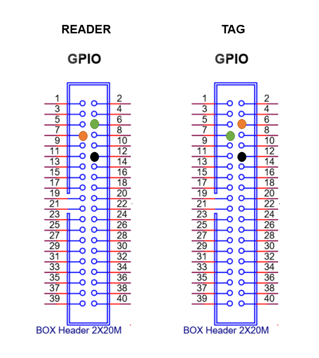

# Getting Started

## Tools

To be able to use the Conformance Tester for TAGs EPC-GEN2 UHF RFID, you'll need the following tools:

- **Hardware:**
    - DE10-Standard + accessories
    - jumpers
- **Software:**
    - Quartus Prime Lite Edition 18.1
    - Cyclone V device support
    - ModelSim-Intel FPGA Edition
    - git

You can find the Quartus and ModelSim software downloads [here](https://fpgasoftware.intel.com/18.1/?edition=lite). The user manual for the DE-10 Standard board can be found [here](https://github.com/Insper/DE10-Standard-v.1.3.0-SystemCD/blob/master/Manual/DE10-Standard_User_manual.pdf).

## Cloning

To clone the project, run the following command on your preferred terminal.

<guide>git clone <https://github.com/pfeinsper/21b-indago-rfid-conformance-tester.git></guide>

The repository is now cloned, and you can start testing/running the project.

## Testing / Running

First, launch Quartus Prime. After launching, click on <guide>File</guide> ➡️ <guide>Open Project</guide>. A window will pop up, and you need to choose the <guide>rfid-conformance-tester.qpf</guide> file, located in the <guide>fpga</guide> folder of the repository. The video below shows how to do so.

<iframe width="560" height="315" src="https://www.youtube.com/embed/X-rHq0sN2uE" title="How to open Quartus project" frameborder="0" allow="accelerometer; autoplay; clipboard-write; encrypted-media; gyroscope; picture-in-picture" allowfullscreen></iframe>

Once the project has been opened, you can work on it; however, the steps to run the project depend on whether you want to simulate using ModelSim or whether you want to launch on the DE-10 Standard board.

### ModelSim guide

To test and simulate the project on ModelSim, the first step is to check the files present in the project. Click on <guide>Project</guide> ➡️ <guide>Add/Remove Files in Project</guide>. It should look like the picture below.

*ModelSim project files*

After checking the files, go to <guide>Project Navigator</guide> on the left panel, click on the dropdown menu that says <guide>Hierarchy</guide>, then click on <guide>Files</guide>. After that, right-click on the <guide>RTL/rfid.vhd</guide> file, and click on the option that says <guide>Set as Top-Level Entity</guide>. Now you can click on the blue play button next to the stop button to start the compilation.

Once the project is compiled, click on <guide>Tools</guide> ➡️ <guide>Platform Designer</guide>. A new window should open. Find the <guide>RFID_NIOS.qsys</guide> file, and open it.

{ style="width: 80%; display: block; margin: auto" }
*Platform Designer qsys file window prompt*

Once you've opened the file, it should show the project's design. On this window, click on <guide>Generate</guide> ➡️ <guide>Generate Testbench System...</guide>.

*Platform Designer schematic with peripherals*

Make sure the settings are as follows, and click on <guide>Generate</guide> on the bottom.

{ style="width: 90%; display: block; margin: auto" }
*Generate testbench window prompt with settings*

Next, you wanna open up the <guide>Nios II Software Build Tools for Eclipse</guide>. If it's your first time opening this tool, the Eclipse window will ask you to choose a workspace. Now the Eclipse window should be open with a blank workspace like the one below.

*Eclipse workspace*

The next step is to import our projects into Eclipse. Go to <guide>File</guide> ➡️ <guide>Import</guide>, and it should show a window like the one below. Click on <guide>Nios II Software Build Tools Project</guide> ➡️ <guide>Import Nios II Software Build Tools Project</guide>, then click <guide>Next</guide>.

{ style="width: 80%; display: block; margin: auto" }
*Import project window prompt*

Now you need to click on the <guide>Browse</guide> button and look for the project. The projects are located at <guide>21b-indago-rfid-conformance-tester/fpga/software</guide>. First, import the <guide>rfid_test</guide> project, then click <guide>Finish</guide>, and make sure that the <guide>Clean project when importing</guide> box is checked. Do the same steps for the <guide>rfid_test_bsp</guide> project.

{ style="width: 80%; display: block; margin: auto" }
*Import project second window prompt*

After both projects have been imported, right-click on <guide>rfid_test_bsp</guide> ➡️ <guide>BSP Editor</guide>. It will open a window like the one below. Make sure that the options are all the same.

{ style="width: 90%; display: block; margin: auto" }
*BSP Editor settings for ModelSim*

You also need to check the <guide>enable_small_driver</guide> box on the <guide>Drivers</guide> tab.

After checking the settings, click on the <guide>Generate</guide> button. Once you generated the BSP, open up the <guide>config.h</guide> file in the <guide>helpers</guide> folder of the <guide>rfid_test</guide> project, and make sure that the value of the <guide>MASK_LOOPBACK</guide> is set to <guide>1</guide>. After that, save the <guide>config.h</guide> file, right-click the <guide>rfid_test</guide> project and click on <guide>Build Project</guide>.

If you had any errors, try cleaning both projects, generating the BSP and rebuilding the project.

Once the build is complete, go to <guide>Run</guide> ➡️ <guide>Run configurations</guide>. It should open up a new window. Right click on <guide>Nios II Modelsim</guide>, and click on <guide>New</guide>. A new ModelSim run configuration has been created, and you can click on <guide>Run</guide> to simulate. The image below shows the configuration settings.

*ModelSim run configuration window prompt*

You can also watch the video below, which shows the step-by-step process.

<iframe width="560" height="315" src="https://www.youtube.com/embed/hdLwmes4Abs" title="YouTube video player" frameborder="0" allow="accelerometer; autoplay; clipboard-write; encrypted-media; gyroscope; picture-in-picture" allowfullscreen></iframe>

### Hardware guide

**Important:** If you want to launch the project on the DE-10 Standard board, a Quartus License is required.

To launch the project on the DE-10 Standard board, the first step is to check the files present in the project. Click on <guide>Project</guide> ➡️ <guide>Add/Remove Files in Project</guide>. It should look like the picture below.

*Hardware implementation project files*

If you are missing the <guide>RFID_NIOS.qip</guide> file, you can generate it using the <guide>Platform Designer</guide>. You can follow the same instructions used on the ModelSim guide to open the <guide>Platform Designer</guide> and open the project's design.

Once the design is open, click on <guide>Generate</guide> ➡️ <guide>Generate HDL...</guide>. The settings should match the ones present in the image below. After that, just click on the <guide>Generate</guide> button, and it should generate the IP variation file.

{ style="width: 80%; display: block; margin: auto" }
*Generate HDL window prompt with settings*

After checking the files, go to <guide>Project Navigator</guide> on the left panel, click on the dropdown menu that says <guide>Hierarchy</guide>, then click on <guide>Files</guide>. After that, right-click on the <guide>RTL/rfid_nios_HW.vhd</guide> file, and click on the option that says <guide>Set as Top-Level Entity</guide>. Now you can click on the blue play button next to the stop button to start the compilation.

After compiling, go to <guide>Tools</guide> ➡️ <guide>Programmmer</guide> to program the board. Be sure that the board is plugged in before opening.

*Quartus Programmer window*

If your board is not showing up on the <guide>Hardware</guide> menu on top, click on <guide>Hardware Setup</guide>, then double click on your board in the menu. After selecting your board, close this window.

{ style="width: 80%; display: block; margin: auto" }
*Hardware Setup window prompt*

Once your board is shown in the <guide>Hardware</guide> menu, click on the <guide>Auto Detect</guide> button on the left menu, and select the corresponding device name for your board (it is engraved on the chip, shown in the image below).

{ style="width: 60%; display: block; margin: auto" }
*Cyclone V device chip (image obtained [here](https://br.mouser.com/images/marketingid/2012/img/135185855.png?v=050521.0810))*

After selecting the corresponding device name, the program may show two chips: one named <guide>SOCVHPS</guide> and the other with your device. Double-click on the <guide>File</guide> tab next to the name of your device, and look for the <guide>rfid-conformance-tester.sof</guide> file for the compiled project, located on the <guide>21b-indago-rfid-conformance-tester/fpga/output_files</guide> folder.

Once you selected the file, check the <guide>Program/Configure</guide> box next to your device as is shown in the image below, then click on <guide>Start</guide> to program the board. Once it's finished, you can close the <guide>Programmer</guide> window.

*Quartus Programmer window with board detected*

After programming the board, get a female/female jumper, plug one end on pin 6 of the GPIO header and the other end on pin 7 of the GPIO header, as shown in the image below.

{ style="height: 40%; display: block; margin: auto" }
*GPIO schematic showing jumper connections (image obtained [here](http://modernhackers.com/wp-content/uploads/2019/12/SDRAM-Board-GPIO-Direction-DE10-Standard-DE1-SoC-ArrowSoCKit.png))*

Once the jumpers are connected, open up the <guide>Nios II Software Build Tools for Eclipse</guide>. You can follow the same steps shown in the ModelSim guide on how to do so.

After both projects have been imported, right-click on <guide>rfid_test_bsp</guide> ➡️ <guide>BSP Editor</guide>.Make sure that the options are the same as the ones present in the image below (they are **not** the same settings from the ModelSim guide).

{ style="width: 90%; display: block; margin: auto" }
*BSP Editor settings for hardware*

The <guide>enable_small_driver</guide> box on the <guide>Drivers</guide> tab needs to be kept checked.

After checking the settings, click on the <guide>Generate</guide> button on the editor. Once you generated the BSP, open up the <guide>config.h</guide> file in the <guide>helpers</guide> folder of the <guide>rfid_test</guide> project. This time, the value of the <guide>MASK_LOOPBACK</guide> needs to be set to <guide>0</guide>. After that, save the <guide>config.h</guide> file, right-click the <guide>rfid_test</guide> project and click on <guide>Build Project</guide>.

If you had any errors, try cleaning both projects, generating the BSP and rebuilding the project.

Once the build is complete, go to <guide>Run</guide> ➡️ <guide>Run configurations</guide>. It should open up a new window. Right click on <guide>Nios II Hardware</guide>, and click on <guide>New</guide>. Once the configuration has been created, go to the <guide>Target Connection</guide> tab, and check if the settings are the same as the one shown in the image below. Once you checked the settings, you can click on <guide>Run</guide> to launch.

*Hardware run configuration window prompt*

You can also watch the video below, which shows the step-by-step process.

<iframe width="560" height="315" src="https://www.youtube.com/embed/2RS8Qlrdf1I" title="YouTube video player" frameborder="0" allow="accelerometer; autoplay; clipboard-write; encrypted-media; gyroscope; picture-in-picture" allowfullscreen></iframe>

### Hardware guide (handshake)

You can also run a handshake version of the project using two DE-10 Standard boards. To do so, follow the same steps shown on the hardware guide until you reach the <guide>rfid_test</guide> project build. Before building the project, you need to find the <guide>tag.c</guide> and  <guide>reader.c</guide> files, located in the <guide>fpga</guide> folder.

Choose one board to act as the tag, and one board to act as the reader; after that, replace the code present in the <guide>hello_world.c</guide> with the corresponding code (one board will have the <guide>tag.c</guide> code and the other will have the <guide>reader.c</guide> code).

After overwriting the code, build the project on each Nios workspace (you can open up two workspaces on the same PC, but it is a little trickier to do so; hence, it is recommended that you do this on two PCs). Once the projects are built, use female/female jumpers to connect the board pins as shown in the image below.

{ style="height: 80%; display: block; margin: auto" }
*GPIO schematic with jumper connections (image obtained [here](http://modernhackers.com/wp-content/uploads/2019/12/SDRAM-Board-GPIO-Direction-DE10-Standard-DE1-SoC-ArrowSoCKit.png))*

After properly connecting the pins, you can use the same run configurations created on the hardware guide to run the project.

**Important:** First, launch the tag configuration, and wait for the <guide>Nios II Console</guide> to print the <guide>waiting for query</guide> message. After that, you can launch the reader configuration.

You can also watch the video below, which shows the step-by-step process.

<iframe width="560" height="315" src="https://www.youtube.com/embed/1bx67orrCxc" title="YouTube video player" frameborder="0" allow="accelerometer; autoplay; clipboard-write; encrypted-media; gyroscope; picture-in-picture" allowfullscreen></iframe>

## How to collaborate

Firstly, you should create a fork of the original repository to work on. You can learn how to do so [here](https://docs.github.com/en/get-started/quickstart/fork-a-repo).
After creating your own fork, you can open a pull request to this repository. The instructions on how to do it can be found [here](https://docs.github.com/en/pull-requests/collaborating-with-pull-requests/proposing-changes-to-your-work-with-pull-requests/creating-a-pull-request-from-a-fork). After making your pull request, it will be reviewed by one of the team members, and if everything's ok, they will approve it. If there are problems with your pull request, the reviewer will inform you of them, and you can make the adjustments necessary.
