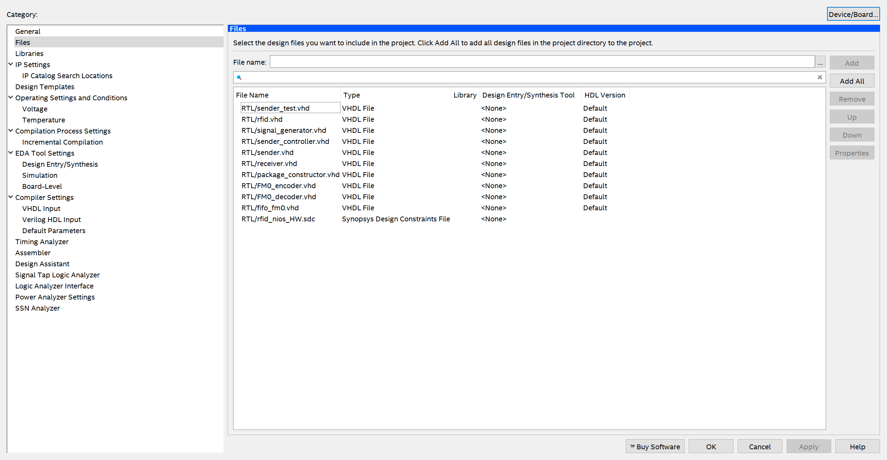

# Getting Started

## Tools

To be able to use the Conformance Tester for TAGs EPC-GEN2 UHF RFID, you'll need the following tools:

- **Hardware:**
    - DE10-Standard + accessories
    - jumpers
- **Software:**
    - Quartus Prime Lite Edition 18.1
    - Cyclone V device support
    - ModelSim-Intel FPGA Edition

You can find the software downloads [here](https://fpgasoftware.intel.com/18.1/?edition=lite). The user manual for the DE-10 Standard board can be found [here](https://github.com/Insper/DE10-Standard-v.1.3.0-SystemCD/blob/master/Manual/DE10-Standard_User_manual.pdf).

## Cloning

First, you must have <guide>git</guide> installed on your machine. After that, you need to run the following command on the directory that you want the repository to be cloned on.

<guide>git clone <https://github.com/pfeinsper/21b-indago-rfid-conformance-tester.git></guide>

The repository is now cloned, and you can start testing/running the project.

## Testing / Running

First, launch Quartus Prime. After launching, click on <guide>File</guide> ➡️ <guide>Open Project</guide>. A window will pop up, and you need to choose the <guide>rfid-conformance-tester.qpf</guide> file, located in the <guide>fpga</guide> folder of the repository. The video below shows how to do so.

<iframe width="560" height="315" src="https://www.youtube.com/embed/X-rHq0sN2uE" title="How to open Quartus project" frameborder="0" allow="accelerometer; autoplay; clipboard-write; encrypted-media; gyroscope; picture-in-picture" allowfullscreen></iframe>

Once the project has been opened, you can work on it; however, the steps to run the project depend on whether you want to simulate using ModelSim or whether you want to launch on the DE-10 Standard board.

### ModelSim guide

To test and simulate the project on ModelSim, the first step is to check the files present in the project. Click on <guide>Project</guide> ➡️ <guide>Add/Remove Files in Project</guide>. It should look like the picture below.

After checking the files, go to <guide>Project Navigator</guide> on the left panel, click on the dropdown menu that says <guide>Hierarchy</guide>, then click on <guide>Files</guide>. After that, right-click on the <guide>RTL/rfid.vhd</guide> file, and click on the option that says <guide>Set as Top-Level Entity</guide>. Now you can click on the blue play button next to the stop button to start the compilation.

### Hardware guide

**Important:** If you want to launch the project on the DE-10 Standard board, a Quartus License is required.

rfid_nios_HW is top-level entity

## How to collaborate

Firstly, you should create a fork of the original repository to work on. You can learn how to do so [here](https://docs.github.com/en/get-started/quickstart/fork-a-repo).
After creating your own fork, you can open a pull request to this repository. The instructions on how to do it can be found [here](https://docs.github.com/en/pull-requests/collaborating-with-pull-requests/proposing-changes-to-your-work-with-pull-requests/creating-a-pull-request-from-a-fork). After making your pull request, it will be reviewed by one of the team members, and if everything's ok, they will approve it. If there are problems with your pull request, the reviewer will inform you of them, and you can make the adjustments necessary.
