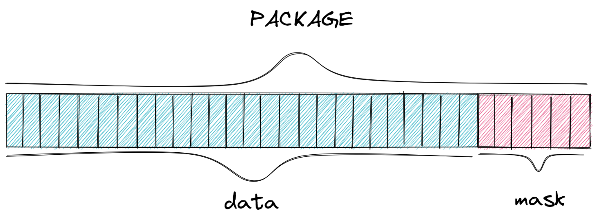
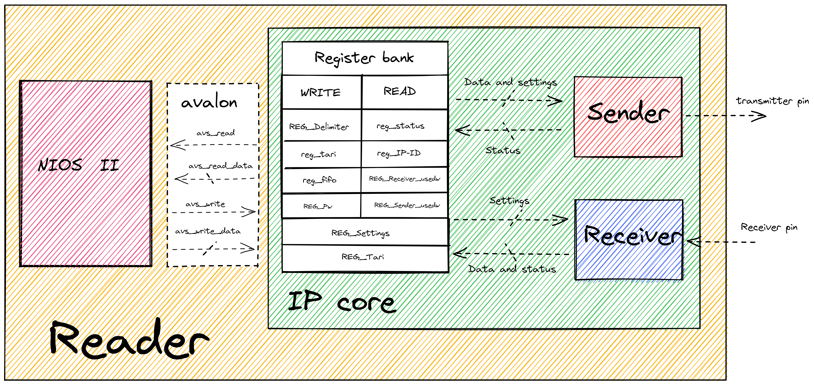
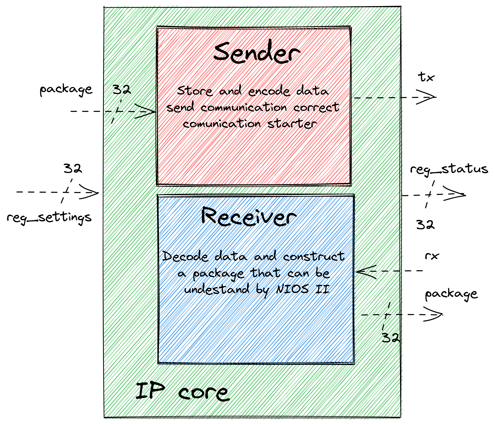
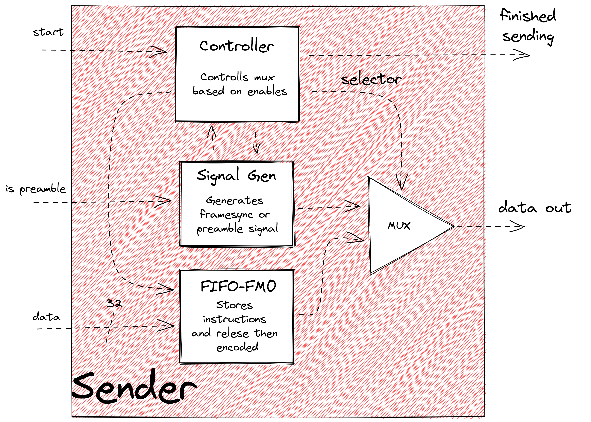
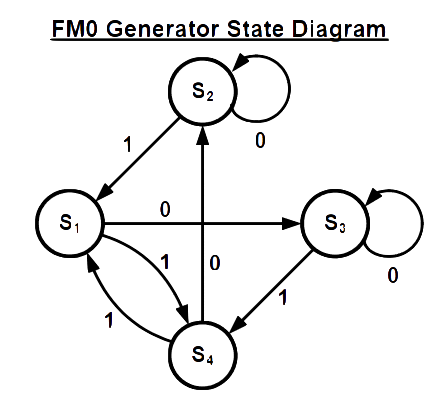
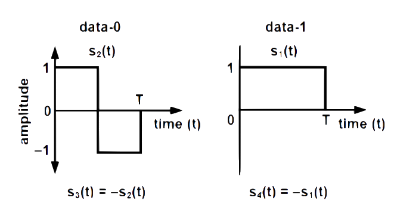
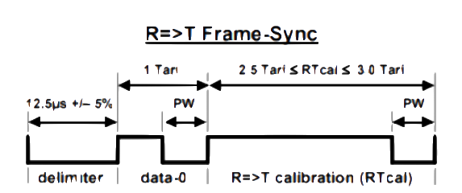
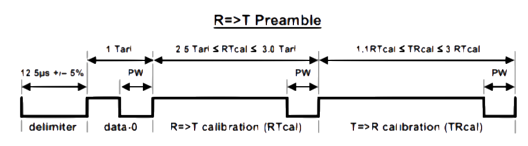
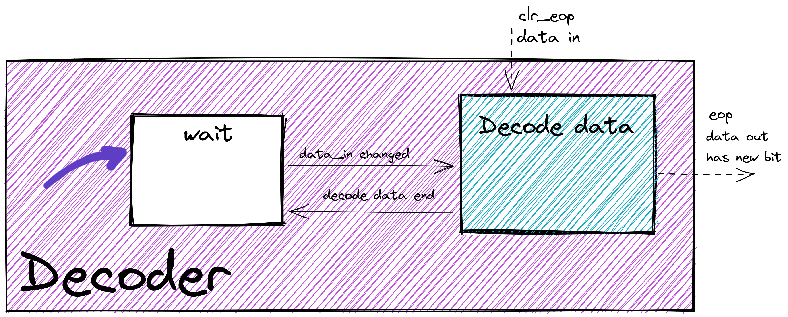

# Hardware

For this project, the chosen solution for implementing the conformance tester was to develop a dedicated hardware in FPGA [^1]. The chosen product was the DE10-Standard[^2] produced by Terasic[^3] as well as a FPGA Cyclone® V[^4] from Intel®. The professor had ample experience working with this specific model, and it also perfectly fits the requirements need to implement the chosen solution. This is because, through a tool called "platform designer"[^5], it can edit its configuration on demand, allowing great flexibility when needed.

The proposed solution makes use of Intel®'s solution development ecosystem, providing flexibility in the use of a soft processor, enabling the integration of peripherals called IP cores to its architecture, as well as allowing the creation of new instructions implemented in the hardware. For more information on these modifications, see the document "NIOS II Custom Instruction User Guide" [^6].

Below is the Analysis & Synthesis Status Report generated by Quartus, which indicates the ROM and RAM memory demanded for this project on the FPGA.

    Analysis & Synthesis Status	Successful - Mon Nov 29 16:43:20 2021
    Quartus Prime Version	18.1.0 Build 625 09/12/2018 SJ Lite Edition
    Revision Name	rfid-conformance-tester
    Top-level Entity Name	rfid_nios_hw
    Family	Cyclone V
    Logic utilization (in ALMs)	N/A
    Total registers	2456
    Total pins	3
    Total virtual pins	0
    Total block memory bits	1,001,728
    Total DSP Blocks	3
    Total HSSI RX PCSs	0
    Total HSSI PMA RX Deserializers	0
    Total HSSI TX PCSs	0
    Total HSSI PMA TX Serializers	0
    Total PLLs	0
    Total DLLs	0

[^1]: FPGA Intel®.
<https://www.intel.com.br/content/www/br/pt/products/programmable.html>
Accessed on: 23/08/2021

[^2]: Terasic DE10-Standard Development Kit.
<https://www.terasic.com.tw/cgi-bin/page/archive.pl?Language=English&CategoryNo=165&No=1081>
Accessed on: 23/08/2021

[^3]: Terasic Inc..
<https://www.terasic.com.tw/en/>
Accessed on: 23/08/2021

[^4]: Cyclone® V GT FPGA.
<https://www.intel.com.br/content/www/br/pt/products/details/fpga/cyclone/v/gt.html>
Accessed on: 23/08/2021

[^5]: Platform Designer - Intel®'s System Integration Tool.
<https://www.intel.com/content/www/us/en/programmable/products/design-software/fpga-design/quartus-prime/features/qts-platform-designer.html>
Accessed on: 23/08/2021

[^6]: Nios II Custom Instruction User Guide.
<https://www.intel.com/content/dam/www/programmable/us/en/pdfs/literature/ug/ug_nios2_custom_instruction.pdf>
Acessed on: 23/08/2021.

## File Hierarchy

All necessary VHDL hardware description files are located in the project’s `fpga/RTL` folder. The top-level entity of the entire processor that includes all the required configuration generics is the `RTL/rfid.vhd` file.

```
rfid.vhd                   - Conformance tester top-level entity
│
├sender.vhd                - Sender component top entity
│   ├FIFO_fm0.vhd             - Encoder-specific FIFO
│   │  ├FM0_encoder.vhd         - Encoder-FM0-specific FIFO
│   │  └fifo_32_32.vhd          - General use FIFO
│   ├sender_controller.vhd    - Controls the flow of packages to the tag
│   └signal_generator.vhd     - Generates preamble or frame-sync signal
│
└receiver.vhd              - Receiver component top entity
    ├FM0_decoder.vhd          - Decoder-FM0-specific FIFO
    ├fifo_32_32.vhd           - General use FIFO
    └package_constructor.vhd  - Stores bits into packages before storing in the FIFO
```

## Packages and commands

This project uses the mandatory commands specified in the EPC-GEN2 documentation. However, those commands have varying sizes and even the same command could vary its size based on the data it sends. To work with this fluctuating command bit size, the group decided to separate the commands into 32-bit packages, where the 26 more significant bits are the actual data of the packet, and the 6 less significant are the mask, indicating how many of the 26 are in use.


*Package visual example*

This way, there are three possible situations given the command sizes:

- The command is larger than one package: if the command has more than 26 bits, it is split into multiple packages, communicated in order through the components (more significant -> less significant);
- The command is the same size as the package: the easiest case, where the package is treated as the full command;
- The command is shorter than one package: in this case  the package will be filled up to the number of bits the command has, and then use the mask to communicate how many of the data bits in the package are useful, ignoring the ones not needed to the command;

For example, if a command has 40 bits, it will be separated into two packets. The first one uses the 26 data bits, and the mask `011010` (26) to indicate all the data bits are in use. Then, the second package would only use 14 of the 26 data bits available to reach the 40 bits the command has, and so the mask would be `001110` (14) to indicate that only 14 bits should be analyzed.

To communicate between the components that the command is over, a `void package 0x00000000` is sent after the last package of the command. This occurs in two times in the product: first, when sending the command to the tag, the NIOS II sends a void package to the Sender to indicate the command is over. Second, when receiving the response from the tag, the Recevier sends a void package to the NIOS II to indicate that the command received is over.

## Solution: READER

The READER, as shown in the diagram below, is the solution implemented in this project, which contains the two main components. An in depth analysis is present in the sections below.


*Reader component visual diagram*

The first one is the NIOS II soft processor, where the group programmed the tests that will be run on the tag. Therefore, its responsible to generate the commands for communicating with the tag, as well as interpreting the responses it receives, to assert whether the tag passes or fails each test.

The second component is the IP core, developed in VHDL, and is responsible for encoding and sending messages to the tag, as well as decoding any responses and passing it through to the processor. Those two tasks have been separated into the sender and the receiver respectively.

The Avalon[^7] Interface is the connection between the NIOS II and the IP core, where the commands, generated in the programming language C, will be passed on to the VHDL sender, and responses will take the opposite path, going from the receiver to the processor.

[^7]: Avalon® Interface.
<https://www.intel.com/content/dam/www/programmable/us/en/pdfs/literature/manual/mnl_avalon_spec.pdf>
Acessed on: 23/08/2021.

### IP CORE

[rfid.vhd entity](https://pfeinsper.github.io/21b-indago-rfid-conformance-tester/doxygen/classrfid.html)

The developed peripheral can be split into two components, visualized in the diagram below. Those are the SENDER, in red, responsible for receiving the data from the NIOS II, encoding and forwarding them to the tag; and the RECEIVER, in blue, responsible for receiving the data from the tag, decoding and forwarding them to the NIOS II.


*IP core visual diagram*

### SENDER

[sender.vhd entity](https://pfeinsper.github.io/21b-indago-rfid-conformance-tester/doxygen/classsender.html)

This component is responsible for encoding the commands generated by the processor, and send them to the tag, respecting the rules of the EPC-GEN2 protocol, including the tari, signal generation and EOP. Its components are detailed below:


*Sender component visual diagram*

### FIFO

[/main/fpga/fifo_32_32.vhd](https://github.com/pfeinsper/21b-indago-rfid-conformance-tester/blob/main/fpga/fifo_32_32.vhd)

The first component of the SENDER is the FIFO, a storage system that receives the assembled commands from the NIOS II and waits for the encoder to send the `read request` flag, signaling for the FIFO to send the oldest package. It is possible that the command to be sent to the tag is composed of more than one package, so the FIFO serves as a storage system for packages already received from the processor until it signals that the entire command is ready for encoding.

For this project, the group opted to use the FIFO produced by Intel, which was obtained through the Quartus automatic generator, the main software used by the group for programming in VHDL language. It is possible to include several customizations before generating the code, and thus, the group defined that the FIFO would have the settings below: 

## FIFO characteristics

- IP variation file type `VHDL`;
- Synchronous reading and writing to clock;
- 32 bits per word;
- 256 word depth;
- `full`, `empty`, `usedw` (number of words in fifo), `synchronous clear` (flush the FIFO);
- Memory block type `auto`;
- Not registered output;
- Circuitry prtotection enabled;

### FIFO_FM0

[fifo_fm0.vhd entity](https://pfeinsper.github.io/21b-indago-rfid-conformance-tester/doxygen/class_f_i_f_o___f_m0.html)

FIFO-FM0 is a component created to separate the data encoding component from the signal-generator and the sender-controller, mapping the inputs: `data` to be encoded, `write request` for the FIFO, `enable` and `tari` to the other components, allowing for individual control of each component.

### Encoder

[FM0_encoder.vhd entity](https://pfeinsper.github.io/21b-indago-rfid-conformance-tester/doxygen/class_f_m0__encoder.html)

The encoder is the main component of the sender, being responsible for encoding the packages received from the FIFO with FM0 band, as specified in the EPC-GEN2, as well as sending the encoded data to the tag. for this purpose, a refined control of the time intervals is necessary to obey the tari, also defined in the protocol as being between 6.25μs and 25μs.

This component has two state machines that work simultaneously, one responsible for communicating with the FIFO and sending it to the tag, while the other encodes the received data. The diagram below demonstrates the first state machine:

- `Wait` is the encoder's default, the state it remains in while it doesn't receive any new packages to encode;
- `Start Send` is the most complex state, where another state machine is present inside it, which is responsible for encoding the packages. Furthermore, it also expects to receive the correct tari to send data to the tag;
- `Wait Send` is a temporary state for when the data has not been fully encoded, and therefore needs to wait until the other state machine finishes the encoding.;
- `Request Data` happens after the data has been sent, and signals the FIFO to send more data. This state is very short, as its only duty is to send a flag to the FIFO, and immediately change to the `Wait Request` state;
- `Wait Request` can happen in two situations. First, if the Encoder is waiting for the next package from the FIFO, going back to the `Start Send` state once it is received. Second, it can happen once the FIFO sends the `FIFO_empty` signal to the Encoder, in which case the void package is removed, waiting for the next command;
- `Wait 1.6 tari` is the formal completion of the command sent to the tag, where a `dummy 1` bit is sent, which will remain active for 1.6 tari and then stop the communication;


*Encoder state-machine visual diagram*

The next image demonstrates the other state machine present in the component, responsible for the encoding of the data. It was defined that it would always start in state `S3`. FM0 encoding transforms each bit of information into two bits, in such a way so that a `1` becomes two bits of the same value (either `1 1` or `0 0`), and a `0` becomes two bits of different values (either `1 0` or `0 1`), where the signal always alternates when encoding a new bit. The change of state occurs after each bit has been sent and is defined by the value of the next bit.

- `S1` encodes `1` into `1 1`;
- `S2` encodes `0` into `1 0`;
- `S3` encodes `0` into `0 1`;
- `S4` encodes `1` into `0 0`;

{style= "width: 50%;"}

*EPC UHF Gen2 Air Interface Protocol, p 32*

{style= "width: 60%;"}
*EPC UHF Gen2 Air Interface Protocol, p 32*

The previously defined `dummy 1` acts as the `EOP` of a command passed to the tag, however it also needs to be encoded, and is always followed by a `0` bit. This is shown in the image below.

{style= "width: 60%"}

*EPC UHF Gen2 Air Interface Protocol, p 33*

#### Signal Generator

[signal_generator.vhd entity](https://pfeinsper.github.io/21b-indago-rfid-conformance-tester/doxygen/class_signal___generator.html)

This component encompasses both the Preamble and Frame-sync functions, and receives flags to determine which one, if any, will be activated.

The Frame-sync is responsible for defining and regulating the interval at which information is sent to the tag, and sharing this interval to all other SENDER components, so that they can communicate within the correct time intervals. This period, named tari, must be within the range defined in the protocol, and have a variation of less than 1% between each pulse.

{style= "width: 70%"}

*EPC UHF Gen2 Air Interface Protocol, p 29*

The Preamble is responsible for the first wave of information sent to the tag for each new command, and it defines which tari will be used throughout the next command. This component needs to be activated for every command that is sent to the tag, except when more than one command is sent in sequence, without a response in between. In this case, the preamble informed will be valid for all subsequent commands, until a response is requested.


*EPC UHF Gen2 Air Interface Protocol, p 29*

#### Sender Controller

[sender_controller.vhd entity](https://pfeinsper.github.io/21b-indago-rfid-conformance-tester/doxygen/classsender__controller.html)

The Sender controller is responsible for managing the components of the sender, such as controlling the encoder, or generating the flags for the signal generator. This component is essential to the sender, since each step must be done in order, so each package can be encoded and sent, and the preamble or frame-sync data can be generated and sent at the start of each new communication.

### RECEIVER

[receiver.vhd entity](https://pfeinsper.github.io/21b-indago-rfid-conformance-tester/doxygen/classreceiver.html)

The RECEIVER is responsible for receiving the responses from the tag, decode them, and notify the NIOS II processor that there was a response, as well as store each package of the response until the processor sends the `read request` flags to analyze them. In order for the received data to be interpreted, it is necessary that the information is decoded and grouped into packages, because it is possible the response is too large for the processor to receive all at once. The group decided to split the RECEIVER into three smaller components, shown and described below:


*Receiver component visual diagram*

#### Decoder

[FM0_decoder.vhd entity](https://pfeinsper.github.io/21b-indago-rfid-conformance-tester/doxygen/class_f_m0__decoder.html)

Since the tag also communicates back to the READER using FM0 encoding, a decoder component is needed to decode the received data, allowing it to be interpreted by the processor. This component was built in a similar way to the sender, through the use of two state machines, one of which operates inside the other. The diagram below demonstrates the first state machine programmed for this purpose:

- `Wait` is the decoder's default, the state it remains in while it doesn't receive any new data to decode;
- `Decode Data`  runs a stand-by mode while for this state machine and activates the other one, responsible for decoding the data received and sending it to the FIFO;



Below is the diagram for the other state machine, responsible for checking if all the time intervals for the communication are correct, as well as decoding the data, and sending it to the FIFO afterwards:

- `Wait` is the decoder's default, the state it remains in while it doesn't receive any new data to decode;
- `Start Counter` starts a time counter as soon as the decoder receives new data, in order to determine if the bit will change after 0.5 or 1.0 tari, then passing to the next state. It is also possible for the bit to remain unchanged for more than 1.0 tari, in which case it will go to the `Pass 1.01 tari` state;
- `Stop Counter` sends `1` to the package constructor if the input signal has not changed, and `0` otherwise;
- `Continue Counter` is necessary because the stop counter always stop at 0.5 tari, so it is activated if no bit change occurs;
- `Pass 1.01 tari` is activated when the tag sends the `dummy 1`, which has a duration of 1.6 tari, and checks if the times are in accordance with the protocol;
- `Counter CS` stops the counter and resets the decoder to its default state;
- `ERROR` is a state that can be activated by almost any other state, as they all check certain characteristics of that tag that must comply with the protocol. If something is irregular, this status will be activated and will send an error message explaining what caused this to happen;


*Decoder state-machine visual diagram*

#### Package Constructor

[package_constructor.vhd entity](https://pfeinsper.github.io/21b-indago-rfid-conformance-tester/doxygen/classpackage__constructor.html)

This component is responsible for assembling the decoded bits into packages and storing them in the FIFO. It gathers the received bits until reaching the limit defined in the code, and then sending to the FIFO. If, however, the package constructor receives the `EOP` signal before completing the package, it will concatenate a mask with the current package to inform how many bits were filled. Lastly, it will the `voi package` to the FIFO and the processor, which indicates the RECEIVER has finished capturing and decoding the whole response command, and that it has been fully passed to the FIFO.

- `Wait` is the package constructor's default, the state it remains in while it doesn't receive any new data to store;
- `New Bit` happens when the decoder sends a decoded bit to the package constructor, which stores it in the current package being constructed;
- `Inc Mask` increases the package mask by 1 representing the new bit received;
- `Max Mask` checks whether the mask, and therefore the package, is full, preparing to send the package if it is;
- `Send Package` sends the current package to the FIFO, an intermediary step before going to the NIOS II processor;
- `Check EOP` checks if the EOP flag is high, and changes state based on the current packet. If it is empty, goes to the `Send void` state, if not goes to the `Send Package`;
- `Clear` clears the current package before starting a new one;
- `Send Void` send to the FIFO an empty package - `0x000000`


*Package constructor state-machine visual diagram*

#### FIFO

[/main/fpga/fifo_32_32.vhd](https://github.com/pfeinsper/21b-indago-rfid-conformance-tester/blob/main/fpga/fifo_32_32.vhd)

The FIFO in the RECEIVER is the same as the one in the SENDER and serves similar purpose; however, its direction is inverted. This FIFO stores packages leaving the package constructor until it receives the `EOP` flag, which also signals the NIOS II that the command is ready to be requested. After this, the FIFO sends one package at a time to the processor whenever it receives a `read request` flag.
