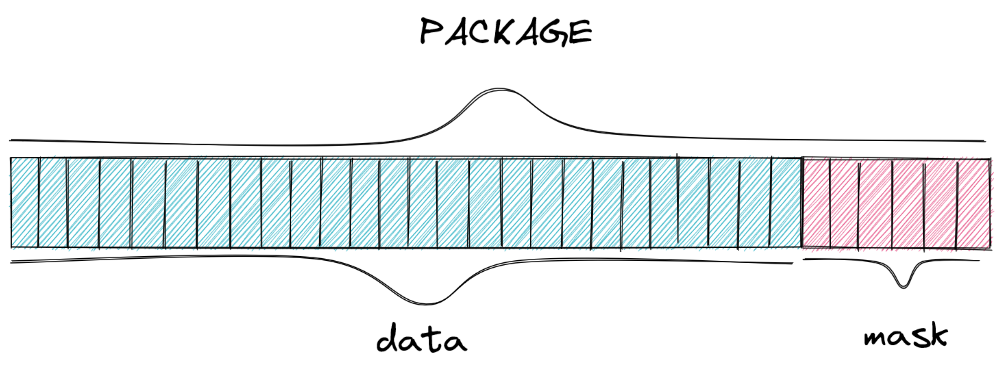

# Hardware

For this project, the chosen solution for implementing the conformance tester was to develop a dedicated hardware in FPGA [^10]. The chosen product was the DE10-Standard produced by Terasic as well as a PFGA Cyclone V from Intel. Our teacher had ample experience working with this specific model, and it also perfectly fits the requirements need to implement the chosen solution. This is because, through a tool called "platform designer", it is able to edit its configuration on demand, allowing great flexibility when needed.

The proposed solution makes use of Intel's solution development ecosystem, providing flexibility in the use of a soft processor, enabling the integration of peripherals called IP rfids to its architecture, as well as allowing the creation of new instructions implmented in the hardware. For more information on these modifications, see the document "Nios II Custom Instruction User Guide" [^11].

[^10]: FPGA Intel.
<https://www.intel.com.br/content/www/br/pt/products/programmable.html>
Accessed on: 23/08/2021

[^11]: Nios II Custom Instruction User Guide.
<https://www.intel.com/content/dam/www/programmable/us/en/pdfs/literature/ug/ug_nios2_custom_instruction.pdf>
Acessed on: 23/08/2021.

## File Hierarchy

All necessary VHDL hardware description files are located in the project’s fpga/rtl/ folder. The top entity of the entire processor including all the required configuration generics is rfid.vhd.

    rfid.vhd                   - Conformance tester top entity
    │
    ├sender.vhd                - Sender component top entity
    │├FIFO_fm0.vhd             - Encoder-specific FIFO
    ││├FM0_encoder.vhd         - Encoder-FM0-specific FIFO
    ││└fifo_32_32.vhd          - General use FIFO
    │├sender_controller.vhd    - Controls the flow of packages to the TAG
    │└signal_generator.vhd     - Generates preamble or frame-sync signal
    │
    └receiver.vhd              - Receiver component top entity
     ├FM0_decoder.vhd          - Decoder-FM0-specific FIFO
     ├fifo_32_32.vhd           - General use FIFO
     └package_constructor.vhd  - Stores bits into packages before storing in the FIFO

## Packages and commands

Our project uses the mandatory commands specified in the EPC-GEN2 documentation. However, those commands have varying sizes and even the same command could vary its size based on the data it sends. To work with this fluctuating command bit size, the group decided to break commands into 32-bit packages, where the 26 more significant bits are the actual data of the packet, and the 6 less significant are the mask, indicating how many of the 26 are in use.

This way, we have three possible situations given the command sizes:

-	The command is larger than one package: if the command has more than 26 bits, we are able to break it into multiple packages, communicated in order through our components (more significant -> less significant);
-	The command is the same size as the package: the easiest case, where we just treat the package as the full command;
-	The command is shorter than one package: in this case we just fill the package up to the number of bits the command has, and then use the mask to communicate how many of the data bits in the package are useful, ignoring the ones not needed to the command;

For example, if a command has 40 bits, we will break it into two packets. The first one uses the 26 data bits, and the mask `011010` (26) to indicate all the data bits are in use. Then, the second package would only use 14 of the 26 data bits available to reach the 40 bits the command has, and so the mask would be `001110` (14) to indicate that only 14 bits should be analyzed.

## READER

The READER, as shown in the diagram below, is the toplevel of our project, which contains the three main components. Here we will give an overview of each component, and a in depth analysis is present in the sections below.

The first one is the NIOS II soft processor, where we programmed the tests that will be run on the TAG. Therefore, its responsible for generating the commands for communicating with the TAG, as well as interpreting the responses it receives, in order to assert wether the TAG passes or fails each test.

The second component is the IP rfid, developed in VHDL, and is responsible for encoding and sending messages to the TAG, as well as decoding any responses and passing the through to the processor. Those two tasks have been separated into the sender and the receiver respectively.

The last one is the Avalon Interface, is the connection between the NIOS II and the IP rfid, where the commands, generated in the programming languace C, will be passed on to the VHDL sender, and responses will take the opposite path, going from the receiver to the processor.

### [IP rfid](https://github.com/pfeinsper/21b-indago-rfid-conformance-tester/blob/main/fpga/RTL/rfid.vhd)

The developed peripheral can be split into two components, visualized in the diagram below. Those are the SENDER, in red, responsible for receiving the data from the NIOS II, encoding and forwading them to the TAG; and the RECEIVER, in blue, responsible for receiving the data from the TAG, decoding and forwarding them to the NIOS II.

### [SENDER](https://github.com/pfeinsper/21b-indago-rfid-conformance-tester/blob/main/fpga/RTL/sender.vhd)

This component is responsible for encoding the commands generated by the processor, and send them to the TAG, respecting the rules of the EPC-GEN2 protocol, including the TARI, preamble and EOP. Its components are detailed below:

**[FIFO](https://github.com/pfeinsper/21b-indago-rfid-conformance-tester/blob/main/fpga/fifo_32_32.vhd)**

The first component of the SENDER is the FIFO, a storage system that receives the assembled commands from the NIOS II and waits for the encoder to send the `read request` flag, signaling for the fifo to send the oldest package. It is possible that the command to be sent to the TAG is composed of more than one package, so the FIFO serves as a storage system for packages already received from the processor until it signals that the entire command is ready for encoding.

For this project, we opted to use the FIFO produced by Intel, which was obtained through the Quartus automatic generator, the main software used by the group for programming in VHDL language. It is possible to include several customizations before generating the code, and thus, the group defined that the FIFo would have, `reset`, `write request`, `read request`, `fifo full` and `fifo empty` flags to facilitate communication with other components of the project. Furthermore, it has a 32-bit word and a depth of 248 words.

**[FIFO_FM0](https://github.com/pfeinsper/21b-indago-rfid-conformance-tester/blob/main/fpga/RTL/fifo_fm0.vhd)**

TODO

**[Encoder](https://github.com/pfeinsper/21b-indago-rfid-conformance-tester/blob/main/fpga/RTL/FM0_encoder.vhd)**

The encoder is the main component of the sender, being responsible for encoding the packages received from the FIFO with FM0 band, as specified in the EPC-GEN2, as well as sending the encoded data to the TAG. for this purpose, a refined control of the time intervals is necessary to obey the TARI, also defined in the protocol as being between 6.25μs and 25μs.

This component has two state machines that work simultaneously, one responsible for communicating with the FIFO and sending it to the TAG, while the other encodes the received data. The diagram below demonstrates the first state machine:

- `Wait` is the encoder's default, the state it remain in while it doesn't receive any new packages to encode;
- `Start Send` is the most complex state, where another state machine is present inside it, which is responsible for encoding the packages. Furthermore, it also expects to receive the correct TARI to send data to the TAG;
- `Wait Send` is a temporary state for when the data has been fully encoded, but due to the TARI limitations, has not been fully sent to the TAG yet. Once it finishes sending the data, it goes to the next state, `Request Data`;
- `Reuest Data` happens after the data has been sent, and signals the FIFO to send more data. This state is very short, as its only duty is to send a flag to the FIFO, and immediately change to the `Wait Request` state;
- `Wait Request` can happen in two situations. First, if the Encoder is waiting for the next package from the FIFO, going back to the `Start Send` state once it is received. Second, it can happen once the FIFO sends the `fifo_empty` signal to the Encoder. In this case, it will proceed to the `Wait 1.6 TARI` state;
- `Wait 1.6 TARI` is the formal completion of the command sent to the TAG, where a `dummy 1` bit is sent, which will remain active for 1.6 TARI and then stop the communication,

The next image demonstrates the other state machine present in the component, responsible for the encoding of the data. It was defined that it would always start in state `S3`. FM0 encoding transforms each bit of information into two bits, in such a way so that a `1` becomes two bits of the same value (either `1 1` or `0 0`), and a `0` becomes two bits of different values (either `1 0` or `0 1`),where the signal always alternates when encoding a new bit. The change of state occurs after each bit has been sent and is defined by the value of the next bit.

- `S1` encodes `1` into `1 1`;
- `S2` encodes `0` into `1 0`;
- `S3` encodes `0` into `0 1`;
- `S4` encodes `1` into `0 0`;

{width=50%}

{width=60%}

The previously defined `dummy 1` acts as the `EOP` of a command passed to the TAG, however it also needs to be encoded, and is always followed by a `0` bit. This is shown in the image below.

{width=60%}

**[Frame-sync](https://github.com/pfeinsper/21b-indago-rfid-conformance-tester/blob/main/fpga/RTL/signal_generator.vhd)**

The frame-sync is responsible for defining and regulating the interval at which information is sent to the TAG, and sharing this interval to all other SENDER components, so that they can communicate within the correct time intervals. This period, named TARI, must be within the range defined in the protocol, and also have a variation of less than 1% between each pulse.

{width=70%}

**[Preamble](https://github.com/pfeinsper/21b-indago-rfid-conformance-tester/blob/main/fpga/RTL/signal_generator.vhd)**

This component is responsible for the first wave of information sent to the TAG for each new command, and it defines which TARI will be used throughout the next command. This component needs to be activated for every command that is sent to the TAG, except when more than one command is sent in sequence, without a response in between. In this case, the preamble imformed will be valid for all subsequent commands, until a response is requested.

### [RECEIVER](https://github.com/pfeinsper/21b-indago-rfid-conformance-tester/blob/main/fpga/RTL/receiver.vhd)

The RECEIVER is responsible for receiving the responses from the TAG, decode them, and notify the NIOS II processor that there was a response, as well as store each package of the response until the processor sends the `read request` flags to analyze them. In order for the received data to be interpreted, it is necessary that the information is decoded and grouped into packages, because it is possible the response is too large for the processor to receive all at once. The group decided to split the RECEIVER into three smaller components, shown and described below:

**[Decoder](https://github.com/pfeinsper/21b-indago-rfid-conformance-tester/blob/main/fpga/RTL/FM0_decoder.vhd)**

Since the TAG also communicates back to the READER using FM0 encoding, a decoder component is needed in order to decode the received data, allowing it to be interpreted by the processor. This component was build in a similar way to the sender, though it is a simpler process, and only one state machine was needed. The diagram below demonstrates the state machine programmed for this purpose:

- `Wait` is the decoder's default, the state it remain in while it doesn't receive any new data to decode;
- `Start Counter` starts a time counter as soon as the decoder receives new data, in order to determine if the bit will change after 0.5 or 1.0 TARI, then passing to the next state. It is also possible for the bit to remain unchanged for more than 1.0 TARI, in which case it will go to the `Pass 1.01 TARI` state;
- `Stop Counter` sends `1` to the package constructor if the input signal has not changed, and `0` otherwise;
- `Continue Counter` is necessary because the stop counter always stop at 0.5 TARI, so it is activated if no bit change occurs;
- `Pass 1.01 TARI` is activated when the TAG sends the `dummy 1`, which has a duration of 1.6 TARI, and checks if the times are in accordance with the protocl;
- `Counter CS` stops the counter and resets the decoder to its default state;
- `ERROR` is a state that can be activated by almost any other state, as they all check certain characteristics of tha TAG that must comply with the protocol. If something is irregular, this status will be activated and will send an error message explainig what caused this to happen;

**[Package Constructor](https://github.com/pfeinsper/21b-indago-rfid-conformance-tester/blob/main/fpga/RTL/package_constructor.vhd)**

This component is responsible for assembling the decoded bits into packages and storing them in the FIFO. It gathers the received bits until reaching the limit defined in the code, and then sending to the FIFO. If, however, the package constructor receives the `EOP` signal before completing the package, it will concatenate a mask with the current package to inform how many bits were filled. Furthermore, it will also extend the `EOP` flag to the FIFO and the processor, so that they know the RECEIVER has finished capturing and decoding the whole response command.

- `Wait`is the package constructor's default, the state it remain in while it doesn't receive any new data to store;
- `New Bit` happens when the decoder sends a dedoded bit to the package constructor, which stores it in the current package being constructed;
- `Inc Mask` increases the package mask by 1 representing the new bit received;
- `Max Mask` checks wether the mask, and therefore the package, is full, preparing to send the package if it is;
- `Send Package` sends the current package to te FIFO, an intermediary step before going to the NIOS II processor;
- `Check EOP` checks if the EOP flag is high, and changes state based on the current packet. If it is empty, goes to the `Send void` state, if not goes to the `Send Package`;
- `Clear` clears the current package before starting a new one;
- `Send Void` send to the FIFO an empty package - `0b00000000000000000000000000000000`

**[FIFO](https://github.com/pfeinsper/21b-indago-rfid-conformance-tester/blob/main/fpga/fifo_32_32.vhd)**

The FIFO in the RECEIVER is the same as the one in the SENDER and serves similar purpose, however with inverted direction. This FIFO stores packages leaving the package constructor until it receives the `EOP` flag, which also signals the NIOS II that the command is ready to be requested. After this, the FIFO sends the packages to the processor one at a time, each time it receives a `read request` flag.
