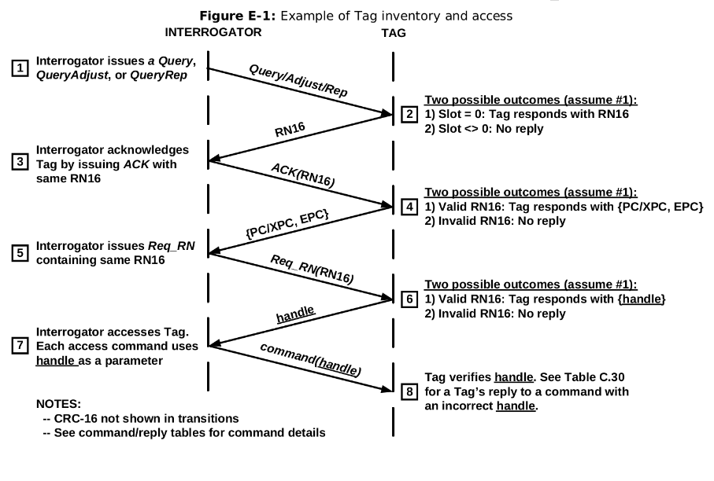

# Conformance Tester for TAGs EPC-GEN2 UHF RFID

- **Students:** Alexandre Almeida Edington / Bruno Signorelli Domingues / Lucas Leal Vale / Rafael Dos Santos
- **Course:** Computer Engineering
- **Semester:** 8
- **Teacher:** Rafael Corsi Ferrão
- **Contact:**
    - alexandreae@al.insper.edu.br
    - brunosd1@al.insper.edu.br
    - lucaslv1@al.insper.edu.br
    - rafaels6@al.insper.edu.br
    - rafael.corsi@insper.edu.br
- **Year:** 2021
- **Repository:** https://github.com/pfeinsper/21b-indago-rfid-conformance-tester
## About

This project aims to develop an equipment capable of performing a series of tests on RFID TAGs, based on the communication protocol "EPC-GEN2 UHF RFID" [^1]. The project simplifies the development of new TAGs that conform to the defined protocol, being able to assert whether the tag satisfies the requirements of said protocol, and also whether the TAG itself is working as intended.

[^1]: EPC UHF Gen2 Air Interface Protocol.
<https://www.gs1.org/sites/default/files/docs/epc/Gen2_Protocol_Standard.pdf>
Accessed on: 16/08/2021.

### Insper

This project is being developed by four computer engineering students at "Insper Instituto de Ensino e Pesquisa" [^2], together with "Indago Services Inc." [^3]. As part of their completion of course work, the students must communicate with their selected company to identify a problem the company currently has and work together to find and implement a solution to it. For each group of students there is also a teaches that acts as a mentor and aids the group with matters of communication, organization, meetings, and project and report feedbacks.

[^2]: Insper Instituto de Ensino e Pesquisa.
<https://www.insper.edu.br/>
Accessed on: 16/08/2021.

[^3]: Indago Devices Inc..
<https://indagodevices.com>
Accessed on: 16/08/2021.

### Indago Devices Inc.

Indago Devices Inc. is a startup that has its headquarters in the city of Birmingham Alabama, US, and works in the field of development and study of electronics. Despite having few employees, it seeks to innovate in the electronics market, specifically in the development of systems that communicate through RFID. They had already been communicating with Insper in the previous semester, and another group of students who planned to do a similar project. This semester they decided to request a conformance tester to help develop RFID TAGs. One of the driving points of the project is that currently there is no similar software available on open source for the RFID community, so it could impact not only their company, but also the worldwide RFID development community.

## Project Overview

The main objective of this project is to develop and assemble a conformance tester for RFID TAGs where a microcontroller will be implemented and an IP-Rfid for communication with the DUT (device under testing). This device then shall be able to run a series of tests as a READER interacting with a TAG through the EPC-GEN2 protocol, analyzing if the TAG works as intended and complies with the requirements of the protocol.

The tests will be implemented using C, allowing for a large number of tests to be made that target different aspects of the TAG's process, independently evaluating most of them. Also, it will be possible to customize the tests or develop new ones should the user need to do so.

This project does not make use of RFID communication, nor does it intend to test whether the TAG is able to communicate through it. Given the complexity of communicating through radio waves, the group and the teacher agreed to not cover those points in this project. Therefore, the device, TAG and computer shall be connected by cables.

### Protocol EPC-GEN2 UHF RFID

Documentation avaliable on: <https://www.gs1.org/sites/default/files/docs/epc/Gen2_Protocol_Standard.pdf>

The main purpose of the protocol is to allow two pieces of hardware, obtained independently, but conforming to the protocol, to communicate flawlessly. To achieve this, it specifies how physical and logical interactions should take place, as well as the possible commands between READER and TAG.

To claim compliance with the protocol, a READER must meet all required specifications, having implemented all mandatory commands, be able to encode, send, receive, and decode data so that it can communicate with a TAG, as well as comply with all local government radio regulations. Optionally, it is allowed to implement any number of optional commands defined in the protocol and any other private commands that do not conflict with any of the mandatory ones. Finally, a READER must not require a TAG to be able to process any command that is not specified as mandatory in the protocol.

To claim compliance with the protocol, a TAG must meet all required specifications, having implemented all mandatory commands, be able to modulate a response signal after receiving a command from a READER, and comply with all local government radio regulations. Optionally, it is allowed to implement any number of optional commands defined in the protocol and any other private commands that do not conflict with any of the mandatory ones. Finally, the TAG must not require a READER to be able to process any optional command from the protocol and is not allowed to modulate a response signal unless it has been commanded to do so by a READER using the commands present in the protocol.

The EPC-GEN2 UHF RFID allow four types of commands in its documentation: 1- mandatory; 2- optional; 3- proprietary; 4- custom. All commands defined in the protocol are either mandatory or optional. Proprietary and custom commands are manufacturer-defined.
Mandatory commands shall be supported by all TAGs and READERs that claim compliance to the protocol.
Optional commands may or may not be supported by TAGs or READERs. If any implements optional commands, then it shall do so in the manner specified in the protocol.
Proprietary commands may be enabled in conformance with the protocol but are not specified in it. All proprietary commands shall be capable of being permanently disabled. Proprietary commands are intended for manufacturing purposes and shall not be used in field-deployed RFID systems.
Custom commands may be enabled in conformance with the protocol but are not specified in it. A READER shall issue a custom command only after singulating a TAG and reading (or having prior knowledge of) the TAG manufacturer’s identification in the TAG’s TID memory. A READER shall use a custom command only in accordance with the specifications of the TAG manufacturer identified in the TID. A custom command shall not solely duplicate the functionality of any mandatory or optional command defined in the protocol by a different method.

**Mandatory Commands**

-	`Select` selects the population of TAGs that will be communicated with. The set can be defined by intersection, union or negation of TAGs;
-	`Query / Query Adjust / Query Rep` starts a communication round between the TAGs and READER, deciding which TAG will participate in the round and sending the Q value for such. `Query Adjust` can adjust que Q value for the TAG. `Query Rep` decreases the value of Q stored within the TAG’s memory by 1;  
-	`ACK / NAK` is sent to the TAG with the same value sent by the TAG when returning to the `Query` command. It signifies the READER recognized the TAG’s response. `NAK` changes the state of the TAGs involved in the round to `arbitrate`, in which they remain as stand-by;
-	`Req_RN` requests a new random number (RN16), sending the previous one as authentication;
-	`Read / Write` requests the reading of information within a specified address in the TAG’s memory bank. `Write` sends information to be written in that address instead;
-	`Kill / Lock` sets the tag as unusable. It is a way to end the communication so that the TAG no longer responds. `Lock` can lock or unlock portions of the TAG’s memory bank for `Write` access.

**Handshake**

The diagram below can be found in annex E of the EPC-GEN2 documentation and represents the Hand-shake between READER and TAG.

The READER sends a `Query` (1), to start an inventory round with the TAG. Upon recognizing the inventory round, the TAG checks whether to respond, and responds with a 16-bit random number `RN16` (2). To establish the communication as successful, the reader sends the `ACK` (3) containing the same RN16. Having received and validated the confirmation, the TAG responds with `PC/XPC, EPC` (4). The reader then send a `Req_RN` (5), again with the old RN16, requesting a new RN16 to continue the communication. If the TAG again validates the RN16, it responds with the `handle` (6), a new RN16. Once the READER receives the `handle`, the handshake is effectively over and the `handle` will be used as authentication for all communication from that point forwards. Every `command` (7) will be sent together with the `handle` and TAG will always verify the `handle` before responding (8). 

### State-of-the-Art Review

The market currently has very diversified solutions in relation to RFID technology. Among the options currently available, proprietary equipment and products are the main competitors, as they are developed by well-established companies. For example, CISC semiconductor [^4], specializing in RFID and NFC services, and working both in the production of laboratory equipment and product testers for the market. Another company that is worth mentioning is HID global [^5], which has several solutions for RFID tags end operates worldwide under sales and distribution of these products.

There are, however, other solutions present in the market, such as open-source solutions. As proprietary products are expensive and not easily customizable, some users choose to develop their own version of those products, leaving them open for others to use and improve. The use of open source helps to develop a highly customizable product, as every user can download the program and make their own changes to better suit their need. Another benefit of open source is the collaboration aspect, where users around the world can suggest changes or improvements, as well as implement them to improve the overall product.

An example of an open-source product is the WISP5 [^6] tag, initially developed at the University of Washington [^7]. The WISP is a battery-free platform with a software-defined implementation of a passive RFID tag, that can communicate with commercial-off-the-shelf RFID readers and is powered by the carrier signal emitted by the reader. It is also built from low-cost components commonly found in hardware stores, allowing WISP users to fabricate their own platforms if desired.

Another open-source product is the S.U.R.F.E.R. (Software-defined UHF RFID Flexible Economical Reader) [^8], an RFID reader. It operates with the same technology as the WISP5 tag, enabling readings up to 60 feet (20 meters) away. Due to it being software-defined, the reader is highly versatile, as the user can input the specifications of the desired tag into the software. It also has a relatively simple structure to find, which result in a low-cost product.

Open-source products bring a series of benefits to the users, such as lesser hardware and software costs, due to the products being intentionally built to be easily accessible; simple licensing management because they often are free to use and impose no restrictions at all; abundant support, as there are many companies that develop open-source products and offer both free and varied levels of paid support.

Given these advantages, Indago Devices opted for a completely open-source product as well. In a meeting with our mentor Wallace Shepherd Pitts, he mentioned he had previously researched and studied some of the options currently available, but nothing had fit with what he had in mind, because the products offered little room for customization regarding the tests made to the tag.

The direct competitors of our project would be the previously mentioned products, which dominate the current market. However, as we are aiming for the open-source architecture, it may attract users interested in a more accessible or customizable product.

Another point mentioned by our mentor is that he also intends to use the project as study material for students at the University of North Carolina [^9], which consequently opens up possibilities for further expansion of the product.

[^4]: Cisc Semiconductors.
<https://www.cisc.at/>
Accessed on: 20/09/2021.

[^5]: HID Global.
<https://www.hidglobal.com/products/rfid-tags>
Accessed on: 20/09/2021.

[^6]: WISP5 Wiki.
<https://sites.google.com/uw.edu/WISP-wiki/home>
Accessed on: 20/09/2021.

[^7]: University of Washington.
https://www.washington.edu/
Accessed on: 20/09/2021.

[^8]: S.U.R.F.E.R. reader.
<https://openrfidreader.net/>
Accessed on: 20/09/2021.

[^9]: University of North Carolina.
https://www.uncg.edu/
Accessed on: 20/09/2021.

### Methodology

During the first weeks of the project, the group settled on definitions and agreements on what would be the methodology used throughout the semester, as well as the different tools and softwares that would be used.

The platform GitHub was chosen as the method for sharing the code between the group members and the teacher, as it can store many important files other than code files, such as diagrams and images the group would produce for the project. Another feature often used by the group is the creation of issues, which can help define and order the group’s next tasks and assign members to complete them.

The day-to-day communication between the members were done through Discord, and meetings with Indago’s representative or the PFE’s coordinators though Microsoft Teams. As meetings with a member of the company were infrequent, taking place every fortnight, the group usually kept a list of questions and issues about the EPC-GEN2 protocol and the project in general so that the representative could provide some support.

Documents and reports were produced and stored in Google Drive, so that multiple members could work on them simultaneously, and also be accessed by the teacher to provide insights and feedback. It also served as another backup storage to the Github repository, in case any problems occurred.

The programming languages VHDL and C were used throughout the project, through the softwares Quartus and Eclipse, which support simulations and tests that aid in the development process. As the client specified that he wanted the project to be open-source, all code, reports and images relevant to this will also be available on the project’s public GitHub repository.

As the project consists of the creation of a conformance tester for the EPC-GEN2 UHF RFID protocol, its documentation was widely used, researched, and discussed by all members of the group during the project, focusing mainly on the communication sections between the READER and TAG, as well as encoding data, and mandatory commands for protocol standards.

Since the project was open-source and available on GitHub, it was decided that the group would also provide a documentation to the whole project, which was later decided would be available through GitHub Pages. Inside, the group would give an in-depth description of all components, and also a tutorial on how to clone, run, utilize and modify this project.

