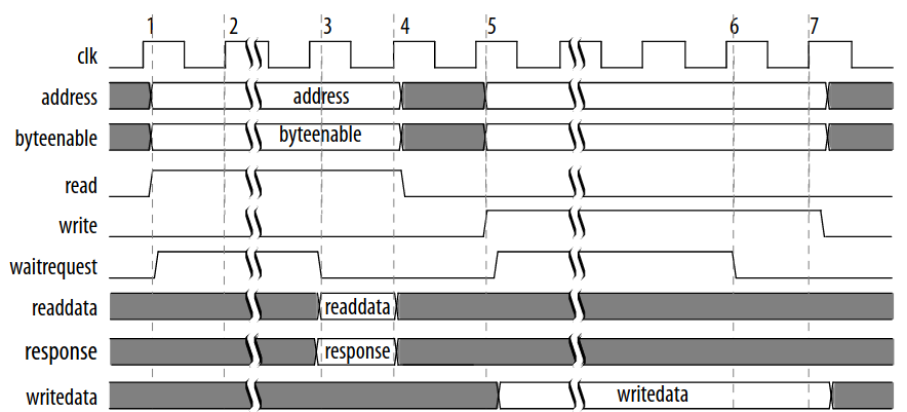

# Conformance Tester for TAGs EPC-GEN2 UHF RFID

- **Students:** Alexandre Almeida Edington / Bruno Signorelli Domingues / Lucas Leal Vale / Rafael Dos Santos
- **Course:** Computer Engineering
- **Semester:** 8
- **Teacher:** Rafael Corsi Ferrão
- **Contact:**
    - alexandreae@al.insper.edu.br
    - brunosd1@al.insper.edu.br
    - lucaslv1@al.insper.edu.br
    - rafaels6@al.insper.edu.br
    - rafael.corsi@insper.edu.br
- **Year:** 2021
- **Repository:** https://github.com/pfeinsper/21b-indago-rfid-conformance-tester
## About

TESTE WORKFLOW V2

This project aims to develop an equipment capable of performing a series of tests on RFID TAGs, based on the communication protocol "EPC-GEN2 UHF RFID" [^1]. The project simplifies the development of  new TAGs that conform to the defined protocol, being able to assert wether the tag satisfies the requirements of said protocol, and also wether the TAG itself is working as intended.

[^1]: EPC UHF Gen2 Air Interface Protocol.
<https://www.gs1.org/sites/default/files/docs/epc/Gen2_Protocol_Standard.pdf>
Accessed on: 16/08/2021.

### Insper

This project is being developed by four computer engineering students at "Insper Instituto de Ensino e Pesquisa" [^2], together with "Indago Services Inc." [^3]. As part of their completion of course work, the students must communicate with their selected company to identify a problem the company currently has and work together to find and implement a solution to it. For each group of students there is also a teaches that acts as a mentor and aids the group with matters of communication, organization, meetings, and project and report feedbacks.

[^2]: Insper Instituto de Ensino e Pesquisa.
<https://www.insper.edu.br/>
Accessed on: 16/08/2021.

[^3]: Indago Devices Inc..
<https://indagodevices.com>
Accessed on: 16/08/2021.

### Indago Devices Inc.

Indago Devices Inc. is a startup that has its headquarters in the city of Birmingham Alabama, US, and works in the field of development and study of electronics. Despite having few employees, it seeks to innovate in the electronics market, specifically in the development of systems that communicate through RFID. They had already been communicating with Insper in the previous semester, and also another group of students who planned to do a similar project. This semester they decided to request a conformance tester to help develop RFID TAGs. One of the driving points of the project is that currently there is no similar sofware avaliable on open source for the RFID community, so it could impact not only their company, but also the worldwide RFID development community.

## Project Overview

The main objetive of this project is to develop and assemble a conformance tester for RFID TAGs where a microcontroller will be implemented and an IP Core for communication with the DUT (device under testing). This device then shall be able to run a series of tests as a READER interacting with a TAG through the EPC-GEN2 protocol, analysing if the TAG works as intended and complies with the requirements of the protocol.

The tests will be implemented using C, allowing for a large amount of tests to be made that target different aspects of the TAG's process, independently evaluating most of them. Also, it will be possible to customize the tests or develop new ones should the user need to do so.

This project does not make use of RFID communication, nor does it intend to test wether the TAG is able to communicate through it. Given the compleity of communicating through radio waves, the group and the teacher agreed to not cover those points in this project. Therefore, the device, TAG and computer shall be connected by cables. 

### Protocol EPC-GEN2 UHF RFID

Documentation avaliable on: <https://www.gs1.org/sites/default/files/docs/epc/Gen2_Protocol_Standard.pdf>

The main purpose of this protocol is to allow two pieces of hardware, obtained independently, but conforming to the protocol, to communicate flawlessly. To achieve this, it specifies how physical and logial interactions should take place, as well as the possible commands between READER and TAG.

There are rules defined for both READER and TAG, however, due to the nature of this project, we will focus only on the TAG, as it is the focus of the tests devised.

To claim compliance with the protocol, a TAG must meet all required specifications, having implementd all mandatory commands, be able to modulate a response signal after receiving a command from a READER, and comply with all government radio regulations. Optionally, it is allowed to implement any number of non-mandatory commands defined in this protocol and any other private commands that do not conflict with any of the mandatory ones. Finally, the TAG must not require a READER to be able to process any non-mandatory comand for this protocol, and is not allowed to modulate a response signal unless it has been commanded to do so by a READER using the commands present in this protocol.

### State-of-the-Art Review

The market currently has very diversified solutions in relation to RFID technology. Among the options currently available, proprietary equipment and products are the main competitors, as they are developed by well-established companies. For example, CISC semiconductor [^4], specializing in RFID and NFC services, and working both in the production of laboratory equipment and product testers for the market. Another company that is worth mentioning is HID global [^5], which has several solutions for RFID tags end operates worldwide under sales and distribution of these products.

There are, however, other solutions present in the market, such as open-source solutions. As proprietary products are expensive and not easily customizable, some users choose to develop their own version of those products, leaving them open for others to use and improve. The use of open source helps to develop a highly customizable product, as every user can download the program and make their own changes to better suit their need. Another benefit of open source is the collaboration aspect, where users around the world can suggest changes or improvements, as well as implement them to improve the overall product.

An example of an open-source product is the WISP5 [^6] tag, initially developed at the University of Washington [^7]. The WISP is a battery-free platform with a software-defined implementation of a passive RFID tag, that can communicate with commercial-off-the-shelf RFID readers and is powered by the carrier signal emitted by the reader. It is also built from low-cost components commonly found in hardware stores, allowing WISP users to fabricate their own platforms if desired.

Another open-source product is the S.U.R.F.E.R. (Software-defined UHF RFID Flexible Economical Reader) [^8], an RFID reader. It operates with the same technology as the WISP5 tag, enabling readings up to 60 feet (20 meters) away. Due to it being software-defined, the reader is highly versatile, as the user can input the specifications of the desired tag into the software. It also has a relatively simple structure to find, which result in a low-cost product.

Open-source products bring a series of benefits to the users, such as lesser hardware and software costs, due to the products being intentionally built to be easily accessible; simple licensing management because they often are free to use and impose no restrictions at all; abundant support, as there are many companies that develop open-source products and offer both free and varied levels of paid support.

Given these advantages, Indago Devices opted for a completely open-source product as well. In a meeting with our mentor Wallace Shepherd Pitts, he mentioned he had previously researched and studied some of the options currently available, but nothing had fit with what he had in mind, because the products offered little room for customization regarding the tests made to the tag.

The direct competitors of our project would be the previously mentioned products, which dominate the current market. However, as we are aiming for the open-source architecture, it may attract users interested in a more accessible or customizable product.

Another point mentioned by our mentor is that he also intends to use the project as study material for students at the University of North Carolina [^9], which consequently opens up possibilities for further expansion of the product.

[^4]: Cisc Semiconductors.
<https://www.cisc.at/>
Accessed on: 20/09/2021.

[^5]: HID Global.
<https://www.hidglobal.com/products/rfid-tags>
Accessed on: 20/09/2021.

[^6]: WISP5 Wiki.
<https://sites.google.com/uw.edu/WISP-wiki/home>
Accessed on: 20/09/2021.

[^7]: University of Washington.
https://www.washington.edu/
Accessed on: 20/09/2021.

[^8]: S.U.R.F.E.R. reader.
<https://openrfidreader.net/>
Accessed on: 20/09/2021.

[^9]: University of North Carolina.
https://www.uncg.edu/
Accessed on: 20/09/2021.

### Methodology

During the first weeks of the project, the group settled on definitions and agreements on what would be the methodology used throughout the semester, as well as the different tools and softwares that would be used.

The platform GitHub was chosen as the method for sharing the code between the group members and the teacher, as it can store many important files other than code files, such as diagrams and images the group would produce for the project. Another feature often used by the group is the creation of issues, which can help define and order the group’s next tasks and assign members to complete them.

The day-to-day communication between the members were done through Discord, and meetings with Indago’s representative or the PFE’s coordinators though Microsoft Teams. As meetings with a member of the company were infrequent, taking place every fortnight, the group usually kept a list of questions and issues about the EPC-GEN2 protocol and the project in general so that the representative could provide some support.

Documents and reports were produced and stored in Google Drive, so that multiple members could work on them simultaneously, and also be accessed by the teacher to provide insights and feedback. It also served as another backup storage to the Github repository, in case any problems occurred.

The programming languages VHDL and C were used throughout the project, through the softwares Quartus and Eclipse, which support simulations and tests that aid in the development process. As the client specified that he wanted the project to be open-source, all code, reports and images relevant to this will also be available on the project’s public GitHub repository.

As the project consists of the creation of a conformance tester for the EPC-GEN2 UHF RFID protocol, its documentation was widely used, researched, and discussed by all members of the group during the project, focusing mainly on the communication sections between the READER and TAG, as well as encoding data, and mandatory commands for protocol standards.

Since the project was open-source and available on GitHub, it was decided that the group would also provide a documentation to the whole project, which was later decided would be available through GitHub Pages. Inside, the group would give an in-depth description of all components, and also a tutorial on how to clone, run, utilize and modify this project.

## Getting Started

### Tools

To be able to use the Conformance Tester for TAGs EPC-GEN2 UHF RFID, you'll need the following tools:

- **Hardware:** DE10-Standard e acessórios
- **Softwares:** Quartus 18.01
- **Documentos:** [DE10-Standard_User_manual.pdf](https://github.com/Insper/DE10-Standard-v.1.3.0-SystemCD/tree/master/Manual)

### Cloning

### Testing / Running

### How to collaborate

## Documentation

This Conformance Tester for TAGs EPC-GEN2 UHF RFID is an open source project. We will specify below all the hardware that we used as the foundation for this project, specifications on how it all comes together, as well as a link to our firmware repository on GitHub.

### File Hierarchy

All necessary VHDL hardware description files are located in the project’s fpga/rtl/ folder. The top entity of the entire processor including all the required configuration generics is rfid.vhd.

    rfid.vhd                   - Conformance tester top entity
    │
    ├sender.vhd                - Sender component top entity
    │├FIFO_fm0.vhd             - Encoder-specific FIFO
    ││├FM0_encoder.vhd         - Encoder-FM0-specific FIFO
    ││└fifo_32_32.vhd          - General use FIFO
    │├sender_controller.vhd    - Controls the flow of packets to the TAG
    │└signal_generator.vhd     - Generates preamble or frame-sync signal
    │
    └receiver.vhd              - Receiver component top entity
     ├FM0_decoder.vhd          - Decoder-FM0-specific FIFO
     ├fifo_32_32.vhd           - General use FIFO
     └package_constructor.vhd  - Stores bits into packets before storing in the FIFO

### Hardware

For this project, the chosen solution for implementing the conformance tester was to develop a dedicated hardware in FPGA [^10]. The chosen product was the DE10-Standard produced by Terasic as well as a PFGA Cyclone V from Intel. Our teacher had ample experience working with this specific model, and it also perfectly fits the requirements need to implement the chosen solution. This is because, through a tool called "platform designer", it is able to edit its configuration on demand, allowing great flexibility when needed.

The proposed solution makes use of Intel's solution development ecosystem, providing flexibility in the use of a soft processor, enabling the integration of peripherals called IP Cores to its architecture, as well as allowing the creation of new instructions implmented in the hardware. For more information on these modifications, see the document "Nios II Custom Instruction User Guide" [^11].

[^10]: FPGA Intel.
<https://www.intel.com.br/content/www/br/pt/products/programmable.html>
Accessed on: 23/08/2021

[^11]: Nios II Custom Instruction User Guide.
<https://www.intel.com/content/dam/www/programmable/us/en/pdfs/literature/ug/ug_nios2_custom_instruction.pdf>
Acessed on: 23/08/2021.

#### READER

The READER, as shown in the diagram below, is the toplevel of our project, which contains the three main components. Here we will give an overview of each component, and a in depth analysis is present in the sections below.

The first one is the NIOS II soft processor, where we programmed the tests that will be run on the TAG. Therefore, its responsible for generating the commands for communicating with the TAG, as well as interpreting the responses it receives, in order to assert wether the TAG passes or fails each test.

The second component is the IP Core, developed in VHDL, and is responsible for encoding and sending messages to the TAG, as well as decoding any responses and passing the through to the processor. Those two tasks have been separated into the sender and the receiver respectively.

The last one is the Avalon Interface, is the connection between the NIOS II and the IP Core, where the commands, generated in the programming languace C, will be passed on to the VHDL sender, and responses will take the opposite path, going from the receiver to the processor.

#### IP CORE

The developed peripheral can be split into two components, visualized in the diagram below. Those are the SENDER, in red, responsible for receiving the data from the NIOS II, encoding and forwading them to the TAG; and the RECEIVER, in blue, responsible for receiving the data from the TAG, decoding and forwarding them to the NIOS II.

#### SENDER

This component is responsible for encoding the commands generated by the processor, and send them to the TAG, respecting the rules of the EPC-GEN2 protocol, including the TARI, preamble and EOP. It consists of four components, detailed below:

**FIFO**

The first component of the SENDER is the FIFO, a storage system that receives the assembled commands from the NIOS II and waits for the encoder to send the `read request` flag, signaling for the fifo to send the oldest packet. It is possible that the command to be sent to the TAG is composed of more than one packet, so the FIFO serves as a storage system for packets already received from the processor until it signals that the entire command is ready for encoding.

For this project, we opted to use the FIFO produced by Intel, which was obtained through the Quartus automatic generator, the main software used by the group for programming in VHDL language. It is possible to include several customizations before generating the code, and thus, the group defined that the FIFo would have, `reset`, `write request`, `read request`, `fifo full` and `fifo empty` flags to facilitate communication with other components of the project. Furthermore, it has a 32-bit word and a depth of 248 words.

**Encoder**

The encoder is the main component of the sender, being responsible for encoding the packets received from the FIFO with FM0 band, as specified in the EPC-GEN2, as well as sending the encoded data to the TAG. for this purpose, a refined control of the time intervals is necessary to obey the TARI, also defined in the protocol as being between 6.25μs and 25μs.

This component has two state machines that work simultaneously, one responsible for communicating with the FIFO and sending it to the TAG, while the other encodes the received data. The diagram below demonstrates the first state machine:

- `Wait` is the encoder's default, the state it remain in while it doesn't receive any new packets to encode;
- `Start Send` is the most complex state, where another state machine is present inside it, which is responsible for encoding the packets. Furthermore, it also expects to receive the correct TARI to send data to the TAG;
- `Wait Send` is a temporary state for when the data has been fully encoded, but due to the TARI limitations, has not been fully sent to the TAG yet. Once it finishes sending the data, it goes to the next state, `Request Data`;
- `Reuest Data` happens after the data has been sent, and signals the FIFO to send more data. This state is very short, as its only duty is to send a flag to the FIFO, and immediately change to the `Wait Request` state;
- `Wait Request` can happen in two situations. First, if the Encoder is waiting for the next packet from the FIFO, going back to the `Start Send` state once it is received. Second, it can happen once the FIFO sends the `fifo_empty` signal to the Encoder. In this case, it will proceed to the `Wait 1.6 TARI` state;
- `Wait 1.6 TARI` is the formal completion of the command sent to the TAG, where a `dummy 1` bit is sent, which will remain active for 1.6 TARI and then stop the communication,

The next image demonstrates the other state machine present in the component, responsible for the encoding of the data. It was defined that it would always start in state `S3`. FM0 encoding transforms each bit of information into two bits, in such a way so that a `1` becomes two bits of the same value (either `1 1` or `0 0`), and a `0` becomes two bits of different values (either `1 0` or `0 1`),where the signal always alternates when encoding a new bit. The change of state occurs after each bit has been sent and is defined by the value of the next bit.

- `S1` encodes `1` into `1 1`;
- `S2` encodes `0` into `1 0`;
- `S3` encodes `0` into `0 1`;
- `S4` encodes `1` into `0 0`;

{width=50%}

{width=60%}

The previously defined `dummy 1` acts as the `EOP` of a command passed to the TAG, however it also needs to be encoded, and is always followed by a `0` bit. This is shown in the image below.

{width=60%}

**Frame-sync**

The frame-sync is responsible for defining and regulating the interval at which information is sent to the TAG, and sharing this interval to all other SENDER components, so that they can communicate within the correct time intervals. This period, named TARI, must be within the range defined in the protocol, and also have a variation of less than 1% between each pulse.

{width=70%}

**Preamble**

This component is responsible for the first wave of information sent to the TAG for each new command, and it defines which TARI will be used throughout the next command. This component needs to be activated for every command that is sent to the TAG, except when more than one command is sent in sequence, without a response in between. In this case, the preamble imformed will be valid for all subsequent commands, until a response is requested.

#### RECEIVER

The RECEIVER is responsible for receiving the responses from the TAG, decode them, and notify the NIOS II processor that there was a response, as well as store each packet of the response until the processor sends the `read request` flags to analyze them. In order for the received data to be interpreted, it is necessary that the information is decoded and grouped into packets, because it is possible the response is too large for the processor to receive all at once. The group decided to split the RECEIVER into three smaller components, shown and described below:

**Decoder**

Since the TAG also communicates back to the READER using FM0 encoding, a decoder component is needed in order to decode the received data, allowing it to be interpreted by the processor. This component was build in a similar way to the sender, though it is a simpler process, and only one state machine was needed. The diagram below demonstrates the state machine programmed for this purpose:

- `Wait` is the decoder's default, the state it remain in while it doesn't receive any new data to decode;
- `Start Counter` starts a time counter as soon as the decoder receives new data, in order to determine if the bit will change after 0.5 or 1.0 TARI, then passing to the next state. It is also possible for the bit to remain unchanged for more than 1.0 TARI, in which case it will go to the `Pass 1.01 TARI` state;
- `Stop Counter` sends `1` to the package constructor if the input signal has not changed, and `0` otherwise;
- `Continue Counter` is necessary because the stop counter always stop at 0.5 TARI, so it is activated if no bit change occurs;
- `Pass 1.01 TARI` is activated when the TAG sends the `dummy 1`, which has a duration of 1.6 TARI, and checks if the times are in accordance with the protocl;
- `Counter CS` stops the counter and resets the decoder to its default state;
- `ERROR` is a state that can be activated by almost any other state, as they all check certain characteristics of tha TAG that must comply with the protocol. If something is irregular, this status will be activated and will send an error message explainig what caused this to happen;

**Package Constructor**

This component is responsible for assembling the decoded bits into packets and storing them in the FIFO. This operation is very simple, just gathering the received bits until reaching the limit defined in the code, and then sending to the FIFO. If, however, the package constructor receives the `EOP` signal before completing the packet, it will concatenate a mask with the current packet to inform how many bits were filled. Furthermore, it will also extend the `EOP` flag to the FIFO and the processor, so that they know the RECEIVER has finished capturing and decoding the whole response command.

**FIFO**

The FIFO in the RECEIVER is the same as the one in the SENDER and serves similar purpose, however with inverted direction. This FIFO stores packets leaving the package constructor until it receives the `EOP` flag, which also signals the NIOS II that the command is ready to be requested. After this, the FIFO sends the packets to the processor one at a time, each time it receives a `read request` flag.

### Firmware

Below is an in depth explanation of the mechanism responsible for the communication between the NIOS II processor and the IP Core, which is composed by the Avalon Interface and a register bank that connect the other components.

#### Avalon Interface

The Avalon Interface, according to its developer Intel (in “Avalon® Interface Specifications”, 2021, p.4): "Avalon® interfaces simplify system design by allowing you to easily connect components in Intel® FPGA. The Avalon interface family defines interfaces appropriate for streaming high-speed data, reading and writing registers and memory, and controlling off-chip devices. Components available in Platform Designer incorporate these standard interfaces. Additionally, you can incorporate Avalon interfaces in custom components, enhancing the interoperability of designs.".

In other words, it is possible to conclude from this excerpt that, in addition to enabling the connection between Intel® FPGA components, that once the interfaces are added to Platform Designer, they are able to connect custom components, which we use for the IP Core in out product. All documentation for other possible interfaces and connection is present in the document “Avalon® Interface Specifications”.

The Avalon Bus can be implemented with multiple features and modules. In this project, Avalon Memory-Mapped will be used, but other alternatives were considered, such as Avalon Interrupt Interfaces and Avalon Streaming Interfaces.

The Avalon Memory-Mapped (Avalon-MM) interface implements the writing and reading of interfaces for the other components used, including Memory, UART Chip and the NIOS II. The interface uses a Host and Agent system in which the Host is the provider of data and commands to the Agent, while the Agent responds to the Host.

These relations can be viewed in the images below, which represent an example of Host and Agent communication in the first image, and an example of writing to a address in the second one.

{width=70%}

{width=70%}

#### Register Bank

The register bank intermediates the communication between the NIOS II processor and the IP Core. Each access to the bus is done through a `read` or `write` command in which they carry data up to 32 bits, a value that represents the size of an integer in the programming language C, as it is the one implemented in the processor. 

As seen in the table, this communication path is responsible for the IP peripheral settings, informing essential values for communication such as `Tari`, `Delimiter` and `Status`, as well as others shown below.

| offset | Name              | Access     | Size |
|--------|-------------------|------------|------|
|      0 | Settings          | Read/Write |   32 |
|      4 | Tari              | Read/Write |   16 |
|      8 | Fifo              | Write      |   32 |
|     12 | Tari_101          | Write      |   16 |
|     16 | Tari_099          | Write      |   16 |
|     20 | Tari_1616         | Write      |   16 |
|     24 | Tari_16584        | Write      |   16 |
|     28 | Pw                | Write      |   16 |
|     32 | Delimiter         | Write      |   16 |
|     36 | RTcal             | Write      |   16 |
|     40 | TRcal             | Write      |   16 |
|      8 | Status            | Read       |   32 |
|     12 | Receiver_data_out | Read       |   32 |
|     16 | Sender_usedw      | Read       |    8 |
|     20 | Receiver_usedw    | Read       |    8 |
|     24 | IP-ID             | Read       |    8 |

**Register 0 - Settings (read/write)**

While some registers indicate a single variable, such as those that indicate `Tari` values, others carry multiple peripheral control variables with them, those being the `settings` and `status register`. Every register is defined bit by bit in the table below:

|         15         |            14           |       13       |           12          |       11       |            10            |        9       |       8      |
|:------------------:|:-----------------------:|:--------------:|:---------------------:|:--------------:|:------------------------:|:--------------:|:------------:|
|          x         |            x            |        x       | Receiver read request | Receiver reset | Sender clr finished send |        x       |   Loopback   |

|          7         |            6            |        5       |           4           |        3       |             2            |        1       |       0      |
|:------------------:|:-----------------------:|:--------------:|:---------------------:|:--------------:|:------------------------:|:--------------:|:------------:|
| Sender is preamble | Sender start controller | Sender has_gen |    Receiver enable    |        x       |     Sender Clear fifo    | Sender  Enable | Sender Reset |

**Register 8 - Status (read)**

In both registers represented here, the bits 31 through 16 are not in use, instead being reserved for future implementations.

| 15 |       14      |       13       |        12       |            11           |              10             |            9           |          8          |
|:--:|:-------------:|:--------------:|:---------------:|:-----------------------:|:---------------------------:|:----------------------:|:-------------------:|
|  x | Receiver full | Receiver empty | Receiver sclear |            x            | Receiver clear error decoder| Receiver error decoder |          x          |

|  7 |       6       |        5       |        4        |            3            |              2              |            1           |          0          |
|:--:|:-------------:|:--------------:|:---------------:|:-----------------------:|:---------------------------:|:----------------------:|:-------------------:|
|  x |       x       |        x       |        x        | Sender finished sending |              x              |            x           | Sender is fifo full |

### Software

Below is an axplanation of the software code of our project, the NIOS II processor.

#### NIOS II

The NIOS II is a soft processor, which means that, unlike discrete processors, such as those in conventional computers, its peripherals and adressing can be reconfigured on demand. This enables the development of a specialized and efficient processor, reducing the costs and time of producing a prototype sincce it is dynamically generated inside the FPGA without the need to produce a new processor.

Communication between the NIOS II and the peripheral IP CORE is done via the Avalon data bus, which is a memory-mapped peripheral. The addressing works as in a common memory, having write, read and address signals, as well as the input and output vectors of this bus.

The NIOS II function is to write the commands and tests in the register banks present in the IP peripheral, so that it can communicate with the TAG. This processor can be viewed as the conductor and all other components as the orchestra, as it is responsible for enabling, configuring, reading and writing data from the Avalon memory to the IP CORE.

## References
