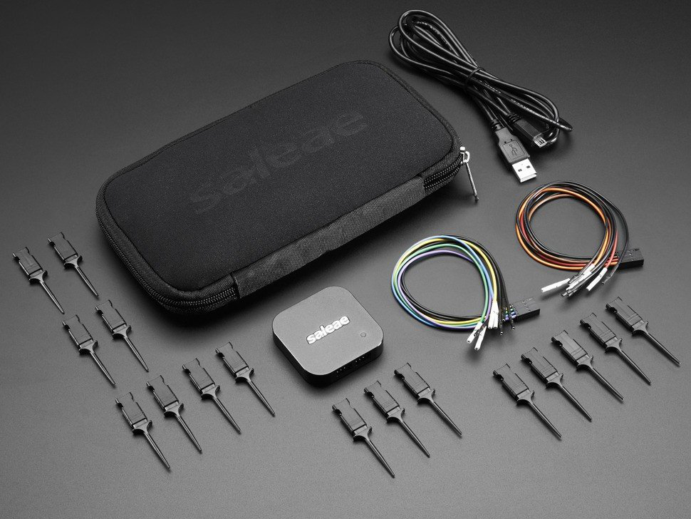
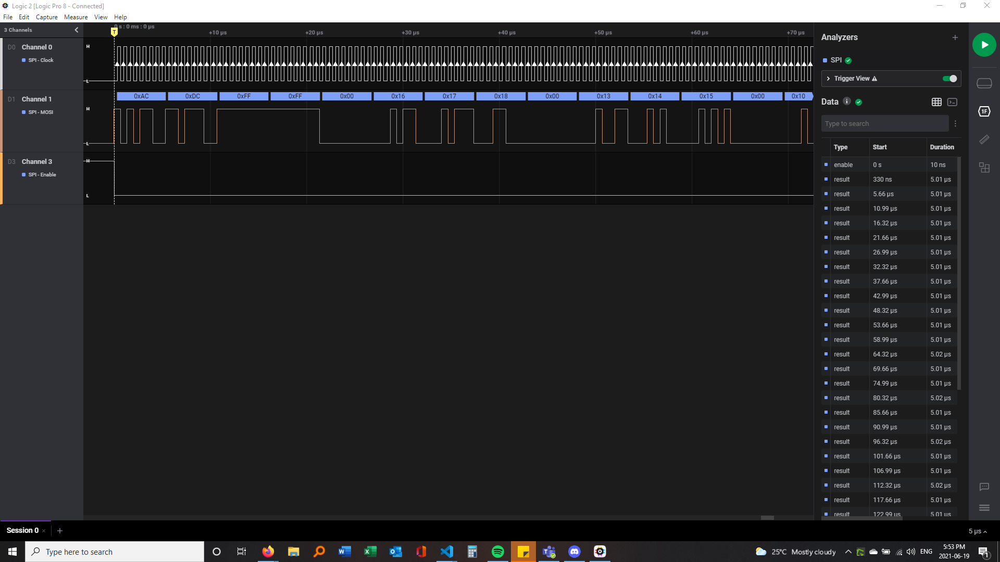

# Testing the components

Due to the complexity of our `.vhd` files, they had to be extensively tested individually. This was done through the ModelSim software, which enabled us to simulate values and compare the results with the expected ones.

## Overview and testing order

The first step was to test each component individually to see if they fit to the specifications of the protocol. Once each component was tested and validated, the next step was to implement the interaction between the components using ModelSim to visualize if the components were working together properly.

After running the necessary simulations, a hardware test was implemented, in which the sender was tested firstly and separately from the receiver component in order to validate the signal transmitted. To do so, a Saleae Logic 8 Analyzer[^1] was used in conjunction with the Logic 2 Software to visualize the signal transmitted by the selected DE-10 Standard board pin. Once the transmitted signal had been validated, the next step was to use the board to send the signal via one pin and receive it on another pin.

[^1]: Saleae Logic 8 Analyzer.
<https://www.saleae.com/>
Accessed on: 01/10/2021.

Lastly, after validating that the hardware implementation worked on a single board, the team decided to test the same communication, but using two boards: one acting as a tag and another acting as a reader. To do so, the transmitter of the tag was plugged into the reader's receiver, and the reader's transmitter was plugged into the tag's receiver. Both boards' ground pin were also connected so that both could share the same ground signal, otherwise the communication would not work.

## Individual testing

This section contains more information on how each component was individually tested.

### Sender

[/main/fpga/RTL/tb/sender_tb.vhd](https://github.com/pfeinsper/21b-indago-rfid-conformance-tester/blob/main/fpga/RTL/tb/sender_tb.vhd)

The `sender_tb.vhd` file tests the sender component by simulating a series of commands, each divided in packages, to be encoded and sent. Each component was manually inserted into the testbench, as the group knew what the sender output should be once the commands had been encoded, and compared the results obtained.

#### FMO Encoder

[/main/fpga/RTL/tb/FM0_encoder_tb.vhd](https://github.com/pfeinsper/21b-indago-rfid-conformance-tester/blob/main/fpga/RTL/tb/FM0_encoder_tb.vhd)

The `FM0_encoder_tb.vhd` file tests the sender encoder component in regards to the encoding process and FIFO communication.

The encoding process tests happen in the same way as the sender tests, in which the program simulates a series of commands, each divided in packages. Each component was manually inserted into the testbench, as the group knew what the encoder output should be once the commands had been encoded, and compared the results obtained.

The FIFO communication test by simulating a FIFO component, and the testbench compares the values of the communication cable to their intended results.

#### Sender Controller

[/main/fpga/RTL/tb/sender_controller_tb.vhd](https://github.com/pfeinsper/21b-indago-rfid-conformance-tester/blob/main/fpga/RTL/tb/sender_controller_tb.vhd)

The sender_controller_tb.vhd file tests the sender controller component by simulating the flags that dictate its functionalities, those being the `has gen`, `start encoder`, `start generator`, `clr_finished sending`.

#### Signal Generator

[/main/fpga/RTL/tb/signal_generator_tb.vhd](https://github.com/pfeinsper/21b-indago-rfid-conformance-tester/blob/main/fpga/RTL/tb/signal_generator_tb.vhd)

The signal_generator_tb.vhd file tests the sender signal generator component by simulating the flags that dictate its functionalities, those being the `has gen`, `start generator`, `is_preamble`.

### Receiver

[/main/fpga/RTL/tb/receiver_tb.vhd](https://github.com/pfeinsper/21b-indago-rfid-conformance-tester/blob/main/fpga/RTL/tb/receiver.vhd)

The receiver_tb.vhd file tests the receiver component by simulating a series of commands, each divided in packages, as a response being sent from the tag. Each component was manually inserted into the testbench, as the group knew what the sender output should be once the commands had been decoded, and compared the results obtained.

#### FM0 Decoder

[/main/fpga/RTL/tb/FM0_decoder_tb.vhd](https://github.com/pfeinsper/21b-indago-rfid-conformance-tester/blob/main/fpga/RTL/tb/FM0_decoder_tb.vhd)

The FM0_decoder_tb.vhd file tests the receiver decoder component by simulating a series of commands, each divided in packages. Each component was manually inserted into the testbench, as the group knew what the decoder output should be once the commands had been decoded, and compared the results obtained.

#### Package Constructor

[/main/fpga/RTL/tb/FM0_decoder_tb.vhd](https://github.com/pfeinsper/21b-indago-rfid-conformance-tester/blob/main/fpga/RTL/tb/package_constructor_tb.vhd)

The package_constructor_tb.vhd file tests the receiver package constructor component by simulating a decoder component that sends decoded data to the package constructor, which once correctly packaged should result in full commands that are compared to the expected command outputs.

## Saleae Logic 8 Analyzer

The Saleae Logic 8 Analyzer is a small analyzer that can be plugged into the user's computer. It can be set up to run on loop, run during a set period of time or set to wait for a trigger of a specific signal. The user can visualize the signal and choose their preferred method for visualizing the signal using the Logic 2 Software.

The images below show the Saleae Logic 8 Analyzer and the Logic 2 Software respectively.

*Logic 8 Analyzer (image obtained [here](https://www.antratek.com/saleae-logic-8-logic-analyzer))*

*Logic 2 Software (image obtained [here](https://i.redd.it/xw4y5j7kna671.png))*

## Handshake between two boards

The steps on how to do this implementation can be read [here](../getting_started/#hardware-guide-handshake).

The purpose of this implementation is to validate if two boards can succesfully communicate using the implemented mandatory commands to do so. A more detailed explanation of how this works can be found in the [example of main code section](../firmware/#example-of-main-code). The image below shows the two boards and their connections.

*Handshake implementation setup with the two DE-10 Standard boards connected*

## How to run any `.vhd` testbench

The video below shows a visual example of how the `.vhd` testbenches were validated using ModelSim (in this case, the `sender_tb.vhd`).

<iframe width="560" height="315" src="https://www.youtube.com/embed/7u0xb6CM-Ng" title="YouTube video player" frameborder="0" allow="accelerometer; autoplay; clipboard-write; encrypted-media; gyroscope; picture-in-picture" allowfullscreen></iframe>